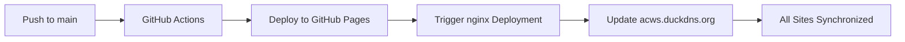

# 🚀 Arista Campus Workshop Documentation

[](https://mbalagot12.github.io/campus-workshop/)
[](http://acws.duckdns.org/)
[](https://squidfunk.github.io/mkdocs-material/)
[](https://www.python.org/)
[](https://developer.mozilla.org/en-US/docs/Web/Progressive_web_apps/Responsive/responsive_design_building_blocks)
[](https://github.com/mbalagot12/campus-workshop/actions)
[](http://acws.duckdns.org/2025.1.ORL/)

**Enterprise-grade documentation platform** for Arista Campus Workshop featuring immersive hands-on labs, interactive GIF demonstrations, and professional deployment automation. Built with modern web technologies and comprehensive mobile responsiveness.

## ✨ **Key Features**

🎯 **Interactive Learning Experience**
- Professional hero banner with animated network elements
- Click-to-zoom GIF demonstrations with lightbox functionality
- Color-coded lab categories (Wired, Wireless, Security, Tools)
- Mobile-responsive design for all devices

🔧 **Advanced Technical Features**
- **Mike versioning** with historical content protection
- **Automated CI/CD pipeline** with dual-site deployment
- **Enhanced GIF display** with professional styling
- **Centralized CSS/JavaScript** architecture

🛡️ **Enterprise-Grade Deployment**
- **Production nginx server**: `acws.duckdns.org`
- **GitHub Pages backup**: Automatic synchronization
- **Version protection**: Orlando 2025.1.ORL historically preserved
- **Automated backups**: Before every deployment

## 🏗️ **Modern Architecture & Technology Stack**

### **📚 Documentation Platform**
- **Engine**: [MkDocs](https://www.mkdocs.org/) with [Material Theme](https://squidfunk.github.io/mkdocs-material/)
- **Versioning**: [Mike](https://github.com/jimporter/mike) with historical content protection
- **Package Management**: [uv](https://github.com/astral-sh/uv) for fast Python dependency management
- **Mobile-First Design**: Responsive breakpoints for phones, tablets, and desktops

### **🎨 Enhanced User Experience**
- **Interactive Hero Banner**: Animated network elements with professional styling
- **Enhanced GIF Display**: Click-to-zoom lightbox with keyboard navigation
- **Color-Coded Categories**: Visual organization (Blue: Wired, Green: Wireless, Orange: Security, Purple: Tools)
- **Professional Typography**: Optimized font scaling and spacing across all devices
- **Touch-Friendly Interface**: Mobile-optimized buttons and navigation

### **🔧 Technical Infrastructure**
- **Centralized CSS Architecture**: `enhanced-components.css` with modular styling
- **JavaScript Enhancements**: `enhanced-gifs.js` for interactive functionality
- **Baby Blue Cloud Icons**: Custom-styled Material Design icons (#87CEEB)
- **Performance Optimized**: Fast loading with optimized assets

### **🚀 Deployment & CI/CD**
- **Dual-Site Deployment**: Production nginx server + GitHub Pages backup
- **Automated Pipeline**: GitHub Actions with comprehensive safety features
- **Version Protection**: Orlando 2025.1.ORL historically preserved
- **Backup System**: Automatic backups before every deployment
- **Cache Management**: Browser cache-busting for immediate updates

## 🌐 **Live Deployment Sites**

### **🚀 Production Environment**
- **Primary Site**: [acws.duckdns.org](http://acws.duckdns.org/) - Production nginx server
- **Current Version**: Atlanta 2025.4.ATL (Enhanced with interactive features)
- **Status**: ✅ **Fully synchronized with all enhancements**

### **📖 Backup & Development**
- **GitHub Pages**: [mbalagot12.github.io/campus-workshop](https://mbalagot12.github.io/campus-workshop/)
- **Status**: ✅ **Auto-synchronized via CI/CD pipeline**
- **Purpose**: Backup site and development testing

### **🛡️ Historical Protection**
- **Orlando 2025.1.ORL**: [acws.duckdns.org/2025.1.ORL](http://acws.duckdns.org/2025.1.ORL/)
- **Status**: 🔒 **PERMANENTLY PROTECTED** - Never modified by CI/CD
- **Purpose**: Historical reference and content preservation

### **📱 Mobile Responsiveness**
All sites now feature:
- ✅ **Mobile-optimized layouts** (≤480px)
- ✅ **Tablet-responsive design** (481px-768px)
- ✅ **Desktop experience** (>768px)
- ✅ **Touch-friendly navigation** across all devices

## 🎯 **Enhanced Features & Improvements**

### **🎨 Interactive Visual Experience**

#### **Professional Hero Banner**
- **Animated Network Elements**: Floating switches with blinking LED indicators
- **Gradient Backgrounds**: Professional blue-to-teal gradients with pulse animations
- **Solutions Grid**: 4-card layout showcasing Wired, Wireless, Security, and Observability
- **Responsive Design**: Adapts from 4-column (desktop) → 2-column (tablet) → 1-column (mobile)

#### **Enhanced GIF Demonstrations**
- **Click-to-Zoom Lightbox**: Professional overlay with smooth animations
- **Keyboard Navigation**: ESC to close, arrow keys for navigation
- **Color-Coded Borders**: Visual categorization matching lab sections
- **Mobile-Optimized**: Touch-friendly controls and responsive sizing
- **Performance Optimized**: Lazy loading and efficient rendering

#### **Color-Coded Lab Categories**
- 🔵 **Wired Labs (Blue)**: EOS, ZTP, CloudVision Studios
- 🟢 **Wireless Labs (Green)**: CV-CUE, WiFi 6E/7, AGNI
- 🟠 **Security Labs (Orange)**: EAP-TLS, UPSK, Zero Trust
- 🟣 **Tools & References (Purple)**: Configuration tools and guides

### **� Mobile-First Responsive Design**

#### **Responsive Breakpoints**
```css
Mobile (≤480px):    Single column, compact layout
Tablet (481-768px): 2-column hero grid, responsive cards
Desktop (>768px):   Full multi-column experience
Large (>1024px):    Enhanced desktop with animations
```

#### **Mobile Optimizations**
- **Touch-Friendly Buttons**: Minimum 44px touch targets
- **Readable Typography**: Optimized font scaling (1.8rem → 0.8rem)
- **No Horizontal Scrolling**: Content fits all screen widths
- **Optimized Images**: Responsive sizing and lazy loading
- **Fast Loading**: Minimized CSS/JS with efficient caching

### **🔧 Technical Architecture Improvements**

#### **Centralized Asset Management**
- **`enhanced-components.css`**: 540+ lines of modular, responsive CSS
- **`enhanced-gifs.js`**: Interactive functionality with keyboard support
- **Conflict Resolution**: Removed duplicate styles from `extra.css`
- **Performance**: Optimized loading and caching strategies

#### **Custom Icon System**
- **Baby Blue Cloud Icons**: Custom-styled Material Design icons (#87CEEB)
- **Consistent Branding**: Arista color palette throughout
- **Scalable Vector Graphics**: Crisp rendering at all sizes
- **Accessibility**: Proper alt text and semantic markup

## �🚀 **Quick Start for Contributors**

### Prerequisites

- **Python 3.9+** (check with `python3 --version`)
- **Git** for version control
- **uv** for package management (recommended)

### 1. Clone and Setup

```bash
# Clone the repository
git clone https://github.com/mbalagot12/campus-workshop.git
cd campus-workshop

# Install uv (if not already installed)
curl -LsSf https://astral.sh/uv/install.sh | sh  # macOS/Linux
# or
irm https://astral.sh/uv/install.ps1 | iex       # Windows PowerShell
```

### 2. Environment Setup with uv

```bash
# Create virtual environment and install dependencies
uv sync

# Activate the virtual environment
source .venv/bin/activate  # macOS/Linux
# or
.venv\Scripts\activate     # Windows
```

### 3. Development Workflow

```bash
# Serve documentation locally with live reload
mkdocs serve

# Open browser to http://127.0.0.1:8000

# Build static site
mkdocs build
```

### 4. Version Management

```bash
# Deploy a new version (example: 2025.3.ATL)
mike deploy 2025.3.ATL latest --update-aliases

# Set default version
mike set-default latest

# List all versions
mike list

# Serve all versions locally
mike serve
```

## 📁 **Enhanced Project Structure**

```text
campus-workshop/
├── .github/workflows/             # 🚀 CI/CD Pipeline (Automated Deployment)
│   ├── deploy-docs.yml            # GitHub Pages deployment with Mike versioning
│   ├── deploy-nginx.yml           # Production nginx server deployment
│   ├── test-docs.yml              # Testing and validation workflows
│   └── maintenance.yml            # Automated maintenance tasks
├── docs/                          # 📚 Documentation Source Files
│   ├── a_wired/                   # 🔵 Wired Lab Guides (A01-A04)
│   ├── b_wireless/                # 🟢 Wireless Lab Guides (B01-B04)
│   ├── c_security/                # 🟠 Security Lab Guides (C01-C03)
│   ├── d_sdwan/                   # 🟣 SD-WAN Lab Guides (D01-D03)
│   ├── lab/                       # 🔧 Lab Access & Setup Instructions
│   ├── references/                # 📖 Reference Materials & Tools
│   │   ├── assets/demos/          # 🎬 Interactive GIF Demonstrations
│   │   └── change_control_workspace/ # 📋 Change Control Workflow Guide
│   ├── assets/                    # 🖼️ Images, Diagrams, and Media
│   ├── stylesheets/               # 🎨 Enhanced CSS Architecture
│   │   ├── enhanced-components.css # 540+ lines of responsive styling
│   │   └── extra.css              # Theme customizations
│   ├── javascripts/               # ⚡ Interactive JavaScript
│   │   └── enhanced-gifs.js       # Lightbox and interaction functionality
│   ├── snippets/                  # 🔄 Reusable Content Snippets
│   └── index.md                   # 🏠 Enhanced Homepage with Hero Banner
├── data/                          # 📊 Lab Assignment Data (CSV files)
├── automation/                    # 🤖 AI Lab Automation Agents
├── includes/                      # 📝 MkDocs Includes (abbreviations, etc.)
├── 📋 Helper Scripts & Documentation
│   ├── refresh-github-actions.sh  # 🔄 CI/CD Pipeline Trigger Script
│   ├── mobile-testing-guide.md    # 📱 Mobile Responsiveness Testing Guide
│   ├── setup-github-secrets.md    # 🔐 GitHub Actions Setup Instructions
│   └── CI_CD_*.md                 # 📚 CI/CD Pipeline Documentation
├── mkdocs.yml                     # ⚙️ MkDocs Configuration
├── pyproject.toml                 # 🐍 Python Project Configuration
├── requirements.txt               # 📦 Python Dependencies
└── uv.lock                        # 🔒 uv Lockfile for Reproducible Builds
```

### **🎯 Key Directory Highlights**

#### **Enhanced Styling (`docs/stylesheets/`)**
- **`enhanced-components.css`**: Comprehensive responsive design system
- **Mobile-first approach**: Breakpoints for all device sizes
- **Interactive elements**: Lightbox, animations, hover effects
- **Color-coded categories**: Visual organization system

#### **Interactive Assets (`docs/references/assets/demos/`)**
- **Professional GIF demonstrations**: Click-to-zoom functionality
- **Change Control workflows**: Step-by-step visual guides
- **Optimized performance**: Lazy loading and efficient rendering

#### **Helper Scripts & Documentation**
- **`refresh-github-actions.sh`**: Automated CI/CD trigger utility
- **`mobile-testing-guide.md`**: Comprehensive responsive design testing
- **`setup-github-secrets.md`**: Complete deployment setup instructions

## 🔧 Development Guidelines

### Adding New Content

1. **Lab Guides**: Place in appropriate directory (`a_wired/`, `b_wireless/`, etc.)
2. **Images**: Store in `docs/assets/images/` with descriptive names
3. **References**: Add to `docs/references/` and update navigation in `mkdocs.yml`
4. **Data Files**: Place CSV files in `data/` directory

### Markdown Standards

- Use **admonitions** for tips, warnings, and notes
- Include **code blocks** with syntax highlighting
- Add **line numbers** and **highlighting** for important lines
- Use **tabbed content** for multi-step procedures
- Include **interactive elements** where appropriate

### Version Management & CI/CD Pipeline

This project uses **Mike** for documentation versioning with **safe CI/CD automation**:

#### **🛡️ Safe Version Updates**

```bash
# Update Nashville version (example)
mike deploy 2025.2.NAS --title "Nashville 2025.2" --update-aliases
git add . && git commit -m "Update Nashville content" && git push

# ✅ Automated CI/CD will safely deploy to:
# - GitHub Pages: https://mbalagot12.github.io/campus-workshop/2025.2.NAS/
# - Operational Site: http://acws.duckdns.org/2025.2.NAS/
# - Orlando 2025.1.ORL remains protected (never updated)
```

#### **🔒 Orlando Protection**

```bash
# ❌ PROTECTED - Orlando version is never updated by CI/CD
# ✅ Historical content preserved at: http://acws.duckdns.org/2025.1.ORL/
```

#### **📋 CI/CD Pipeline Features**

- **🛡️ Operational Site Protection** - Never overwrites existing Mike site
- **🔒 Orlando 2025.1.ORL Protection** - Triple-layer protection for historical content
- **💾 Automatic Backups** - Created before any deployment
- **🧪 Dry Run Testing** - Verify deployments before going live
- **📊 Selective Updates** - Only updates specified version directories

For detailed CI/CD documentation, see: **[CI_CD_README.md](./CI_CD_README.md)**

### **🚀 Advanced CI/CD Pipeline**

Our enterprise-grade CI/CD pipeline provides **safe, automated deployment** with comprehensive protection:

#### **🔄 Automated Workflow**


#### **🛡️ Safety Features**
- **Orlando Protection**: 2025.1.ORL version permanently protected
- **Backup Creation**: Automatic backups before every deployment
- **Selective Updates**: Only updates latest and new versions
- **Dry Run Testing**: Test deployments without going live
- **Cache Busting**: Forces browser refresh for immediate updates

#### **📊 Deployment Targets**
1. **GitHub Pages**: `mbalagot12.github.io/campus-workshop/`
2. **Production nginx**: `acws.duckdns.org` (EC2: us-east-2)
3. **Version Management**: Mike-based versioning with aliases

### **🎯 Enhanced User Experience Features**

#### **Interactive GIF Demonstrations**
- **Click-to-Zoom Lightbox**: Professional overlay with smooth animations
- **Keyboard Navigation**: ESC to close, arrow keys for multi-GIF navigation
- **Color-Coded Borders**: Visual categorization matching lab sections
- **Mobile Touch Support**: Optimized for all devices
- **Performance**: Lazy loading and efficient rendering

#### **Professional Hero Banner**
- **Animated Network Elements**: Floating switches with LED indicators
- **Responsive Solutions Grid**: 4→2→1 column adaptation
- **Professional Styling**: Arista brand colors and typography
- **Interactive Hover Effects**: Desktop enhancement features

## 🚀 Deployment

### **Automated CI/CD Pipeline** ⭐

The project features a **safe CI/CD pipeline** that automatically deploys to both sites:

**Triggers:**
- Push to `main` branch
- Manual GitHub Actions workflow dispatch

**Deployment Targets:**

- **GitHub Pages**: [mbalagot12.github.io/campus-workshop](https://mbalagot12.github.io/campus-workshop/)
- **Operational Site**: [acws.duckdns.org](http://acws.duckdns.org/)

**Safety Features:**

- ✅ **Non-destructive updates** - Never overwrites operational site
- ✅ **Orlando protection** - 2025.1.ORL version never touched
- ✅ **Automatic backups** - Created before any changes
- ✅ **Dry run testing** - Test deployments before going live

### Manual Deployment (Advanced)

```bash
# Deploy specific version locally
mike deploy 2025.2.NAS --title "Nashville 2025.2" --update-aliases

# Push to trigger CI/CD
git add . && git commit -m "Update content" && git push
```

## 🛠️ Troubleshooting

### Common Issues

- **uv not found**: Install uv using the installation script above
- **Permission errors**: Ensure proper Git credentials for GitHub
- **Build failures**: Check `mkdocs.yml` syntax and file paths
- **Version conflicts**: Use `uv sync` to resolve dependencies

### Development Tips

- Use `mkdocs serve` for live reload during development
- Test all versions with `mike serve` before deployment
- Validate markdown with the built-in linting tools
- Check responsive design on mobile devices

## 🔧 **CI/CD Pipeline for Collaborators**

### **Safe Version Updates**

When updating workshop content, the CI/CD pipeline ensures safe deployment:

1. **Make Changes**: Edit content in appropriate version directories
2. **Deploy Locally**: `mike deploy 2025.X.XXX --title "Workshop Name"`
3. **Commit & Push**: `git add . && git commit -m "Update content" && git push`
4. **Automated Deployment**: Pipeline safely updates both sites

### **Protection Guarantees**

- **🛡️ Orlando 2025.1.ORL**: Historical content never modified
- **🏠 Operational Site**: `acws.duckdns.org` never overwritten
- **💾 Backups**: Automatic backup creation before changes
- **🧪 Testing**: Dry run capability for safe testing

### **For Detailed CI/CD Documentation**

See: **[CI_CD_README.md](./CI_CD_README.md)** for complete pipeline documentation.

## 📚 Resources

- **[MkDocs Documentation](https://www.mkdocs.org/)** - Core documentation engine
- **[Material Theme](https://squidfunk.github.io/mkdocs-material/)** - Theme and components
- **[Mike Documentation](https://github.com/jimporter/mike)** - Version management
- **[uv Documentation](https://github.com/astral-sh/uv)** - Package management
- **[GitHub Pages](https://pages.github.com/)** - Hosting platform
- **[GitHub Actions](https://docs.github.com/en/actions)** - CI/CD automation

## 👥 **Contributors & Development Team**

### **🏗️ Original Architecture**
- **Kyle Bush** ([kbush@arista.com](mailto:kbush@arista.com)) - Original content creator and lab design
- **Larry Gomez** ([larry@arista.com](mailto:larry@arista.com)) - Technical reviewer and validation

### **🚀 Enhanced Channel Partner Edition**
- **Miguel Balagot** ([mbalagot@arista.com](mailto:mbalagot@arista.com)) - Lead developer for enhanced features:
  - **Interactive Visual Experience**: Hero banner, GIF lightbox, color-coded categories
  - **Mobile-First Responsive Design**: Comprehensive breakpoint system
  - **Enterprise CI/CD Pipeline**: Automated deployment with safety features
  - **Technical Architecture**: Centralized CSS/JS, performance optimization
  - **Version Management**: Mike versioning with Orlando protection
  - **Modern Tooling**: uv package management, GitHub Actions automation

### **🎯 Key Accomplishments**

#### **Visual & UX Enhancements**
- ✅ **Professional Hero Banner** with animated network elements
- ✅ **Interactive GIF Lightbox** with keyboard navigation
- ✅ **Mobile-Responsive Design** across all devices
- ✅ **Color-Coded Lab Categories** for visual organization
- ✅ **Baby Blue Cloud Icons** with consistent branding

#### **Technical Infrastructure**
- ✅ **Automated CI/CD Pipeline** with dual-site deployment
- ✅ **Version Protection System** preserving Orlando 2025.1.ORL
- ✅ **Centralized Asset Architecture** with modular CSS/JS
- ✅ **Performance Optimization** with caching and lazy loading
- ✅ **Helper Scripts** for easy deployment and testing

#### **Enterprise Features**
- ✅ **Production nginx Server** at acws.duckdns.org
- ✅ **GitHub Pages Backup** with auto-synchronization
- ✅ **Comprehensive Documentation** with setup guides
- ✅ **Mobile Testing Framework** with responsive validation
- ✅ **Safe Deployment Process** with backup and rollback capabilities

## 📄 License

This project is maintained by Arista Networks for educational purposes. All content is proprietary to Arista Networks and intended for authorized workshop participants.

---

**Ready to contribute? Fork the repo, make your changes, and submit a pull request! 🚀**
