# B-03 | Guest Wireless with AGNI

## Overview

--8<--
docs/snippets/login_agni.md
--8<--

## AGNI Guest Captive Portal

Let's configure a Guest Captive Portal using AGNI for wireless clients. To configure the guest portal, you must configure both AGNI and CV-CUE.

1. Navigate to `Guest > Portals` under the section `Identity`.

    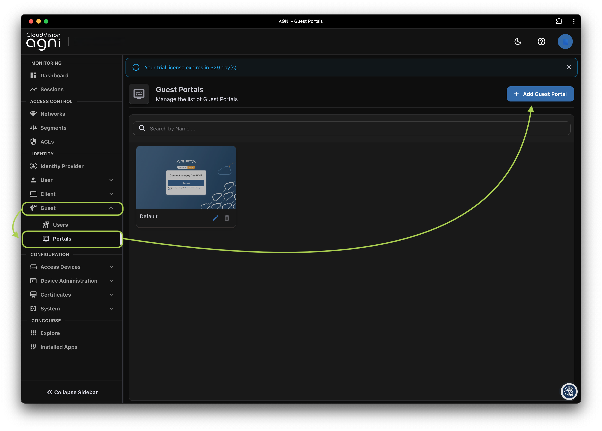

2. Click `+ Add Guest Portal` and configure the following

    ???+ example "Network Settings"
        | Field                    |    Student 1    |    Student 2    |
        | ------------------------ | :-------------: | :-------------: |
        | Portal Name              | `ATD-##A-GUEST` | `ATD-##B-GUEST` |
        | Authentication Types     |  Clickthrough   |  Clickthrough   |
        | Re-Authuthenticate Guest |     Always      |     Always      |
        | CAPTCHA                  |    Disabled     |    Disabled     |

    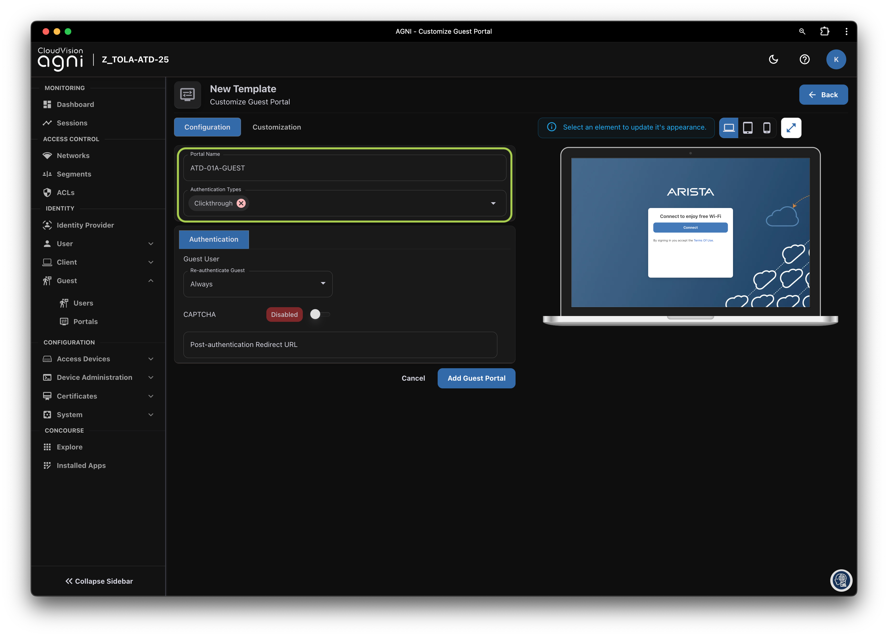

3. Click the Customization tab to customize the portal settings, and notice the elements. When done, click `Add Guest Portal`. The portal gets listed in the portal listing.

      - [x] Page
      - [x] Login Toggle
      - [x] Terms of Use and Privacy Policy
      - [x] Logo
      - [x] Guest Login Submit Button
      - [x] Etc

    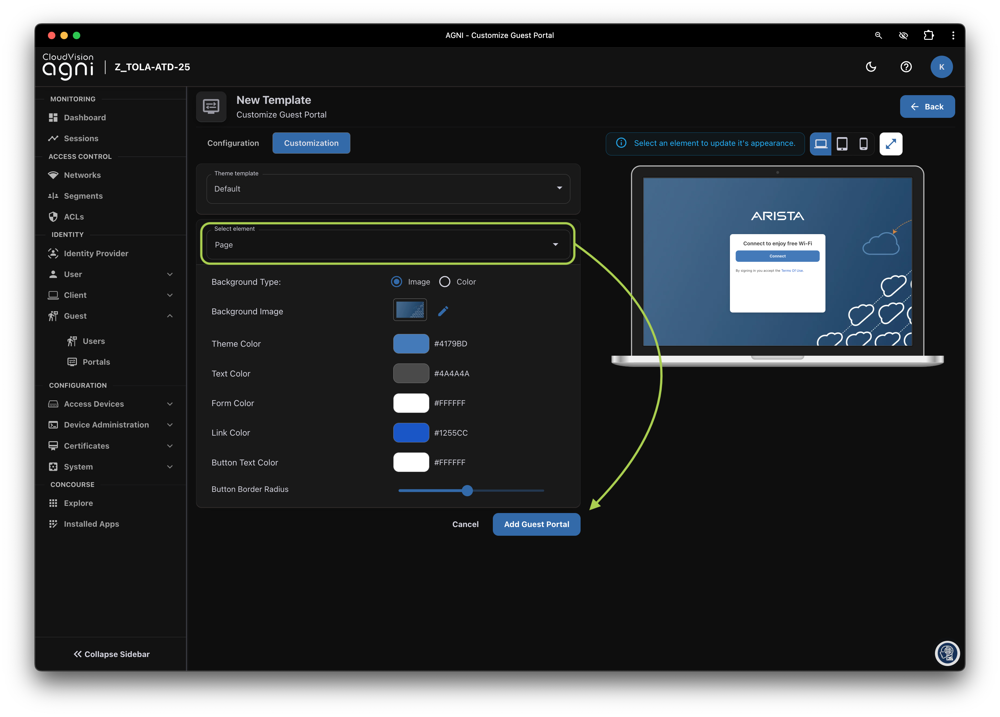

4. Click `Back`
5. Navigate to the `Networks` under the section `Access Control`. Click on `+ Add Network`

    

6. Add a new network with following settings

    ???+ example "Network Settings"
        | Field                                   |    Student 1    |    Student 2    |
        | --------------------------------------- | :-------------: | :-------------: |
        | Name                                    | `ATD-##A-GUEST` | `ATD-##B-GUEST` |
        | Connection Type                         |    Wireless     |    Wireless     |
        | SSID                                    | `ATD-##A-GUEST` | `ATD-##B-GUEST` |
        | Authentication Type                     | Captive Portal  | Captive Portal  |
        | Captive Portal Type                     |    Internal     |    Internal     |
        | Select Internal Portal                  | `ATD-##A-GUEST` | `ATD-##B-GUEST` |
        | Internal Role for Portal Authentication | `Portal A Role` | `Portal B Role` |

    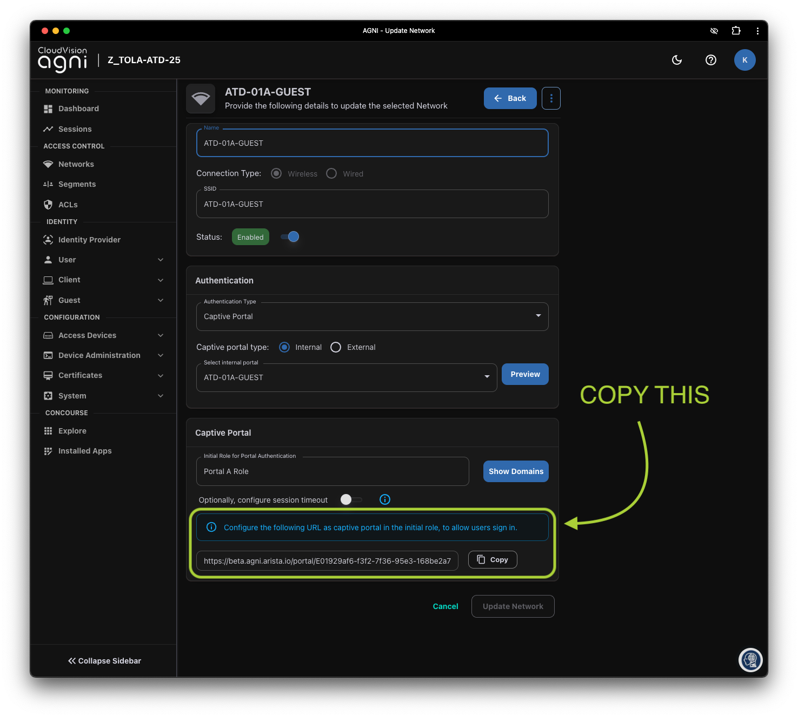

7. Click `Add Network`.
8. Copy the portal URL at the bottom of the page.

    !!! tip "AGNI URL"

        Make sure to **copy the AGNI Guest Portal URL**, we are going to use this in CV-CUE for Guest Portal Redirection.

--8<--
docs/snippets/login_cvcue.md
--8<--

## Role Profile (CV-CUE)

Let's configure two role profiles and the SSID settings. This will ensure our guest SSID we will create is enabled with redirection to AGNI captive portal. These roles are

- Portal (A/B) Role: This role will be assigned initially to ensure captive portal redirection
- Guest (A/B) Role: This role will be assigned by AGNI to drop our client into a "Guest Role" where we can further define policy

### Portal Role Profile

1. Log in to CV-CUE and navigate to `Configure > Network Profiles > Role Profile`.

    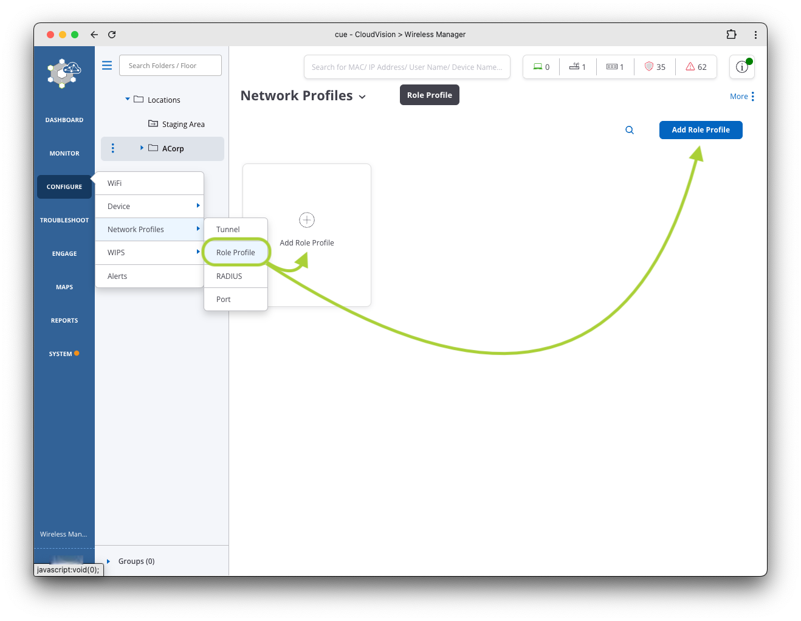

2. Add a `Role Profile` using the setting below

    ???+ example "Network Settings"
        | Field             |      Student 1       |      Student 2       |
        | ----------------- | :------------------: | :------------------: |
        | Role Name         |   `Portal A Role`    |   `Portal B Role`    |
        | Profile Name      |   `Portal A Role`    |   `Portal B Role`    |
        | Redirection       |       Enabled        |       Enabled        |
        | Redirection Type  |  Static Redirection  |  Static Redirection  |
        | Redirect URL      | `<Copied from AGNI>` | `<Copied from AGNI>` |
        | HTTPS Redirection |       Enabled        |       Enabled        |
        | Common Name       |    www.arista.com    |    www.arista.com    |
        | Organization      |   Arista Networks    |   Arista Networks    |
        | Organization Unit |   Arista Networks    |   Arista Networks    |

    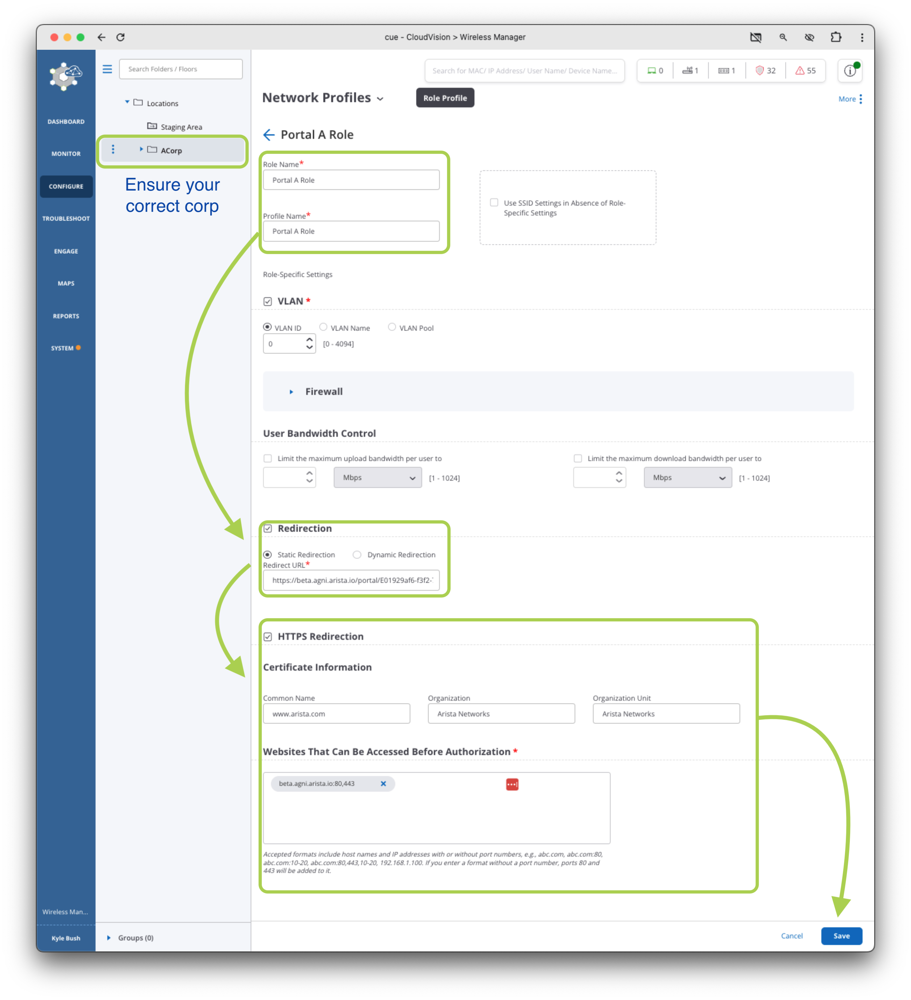

3. Click `Save` at the bottom of the page.

### Guest Role Profile

Next, we’ll configure a Guest Role in CV-CUE to assign to Guest Users post authentication.

1. In CV-CUE, navigate back to `Configure > Network Profiles > Role Profile`.

2. Click `Add Role Profile`.

3. Add the `Role Name` as follows, this role is simple, but see the [additional information](#additional-information) below to explore some of the options you have with roles.

    ???+ example "Network Settings"
        | Field     |   Student 1    |   Student 2    |
        | --------- | :------------: | :------------: |
        | Role Name | `Guest A Role` | `Guest B Role` |

    

4. Click `Save` at the bottom of the page
5. You should now have two roles, we will refer back to these roles in both the AGNI and CUE SSID configuration.

    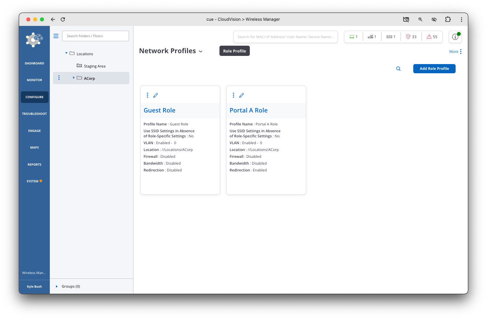

### Additional Information

- :material-arrow-split-vertical:{ .lg .middle } **VLAN**

    ---

    In this lab the VLAN is set to 0. In production networks you would define the Guest VLAN ID or Name that you want to assign to the Guest Users.

- :material-wall:{ .lg .middle } **Firewall**

    ---

    Layer 3-4 and Application Firewall Rules can be assigned to the Guest User Role.

- :fontawesome-solid-gauge-high:{ .lg .middle } **User Bandwidth Control**

    ---

    Upload and Download Bandwidth Limits can be assigned to the Guest User Role.

## Portal Segment (AGNI)

Next, we’ll configure a Segment in AGNI to assign the Guest Role Profile post authentication.

1. Go back to AGNI and navigate to the Access Control > Segments.
2. Add a new Segment by clicking on `+ Add Segment`

    !!! note "Conditions for segments must MATCH ALL conditions line by line."

    ???+ example "Network Settings"
        | Field               |             Student 1             |             Student 2             |
        | ------------------- | :-------------------------------: | :-------------------------------: |
        | Name                |          `ATD-##A-GUEST`          |          `ATD-##B-GUEST`          |
        | Condition           |  `Network:Name is ATD-##A-GUEST`  |  `Network:Name is ATD-##B-GUEST`  |
        | Action              | `Arista-Wifi:Assign Role Profile` | `Arista-Wifi:Assign Role Profile` |
        | Action Role Profile |          `Guest A Role`           |          `Guest B Role`           |

    

3. Click `Add Segment` at the bottom of the page.
4. Let's now add the Guest SSID

## Guest Portal SSID (CV-CUE)

Lastly, we’ll configure and enable the Guest Captive Portal SSID and assign the pre and post authentication roles.

1. Let's navigate back to CV-CUE
2. Select Correct location `ACorp` (student 1) or `BCorp` (student 2)

    !!! warning "CV-CUE Locations"

        Reminder, make sure you have selected your appropriate corporation before creating the SSID!

3. Navigate to `Configure > WiFi` and click on `Add SSID`

    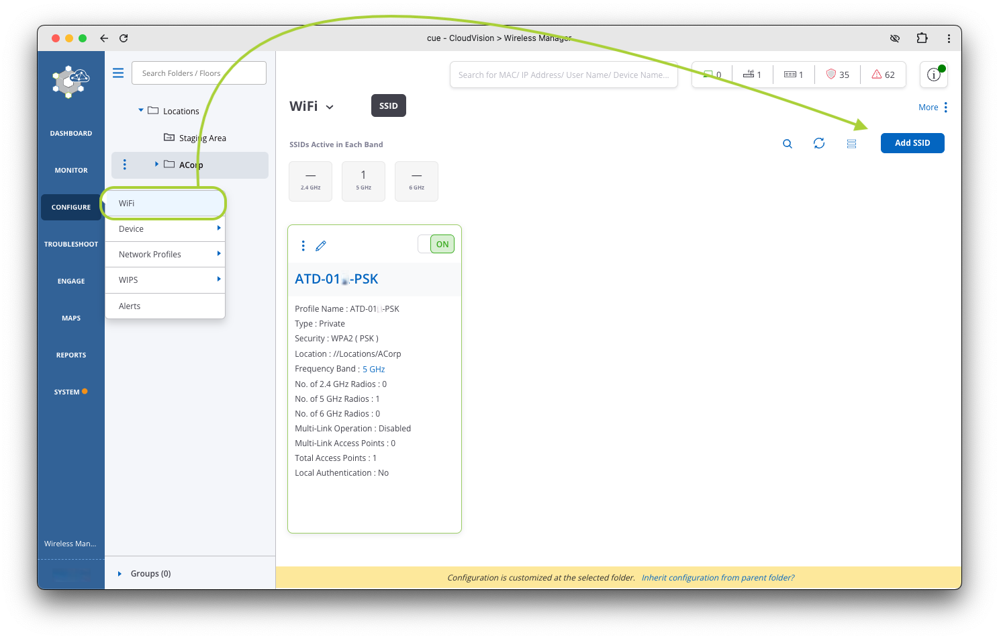

4. Configure the SSID `Basic` settings using the settings below

    ???+ example "SSID Basic Settings"

        | Setting   |    Student 1    |    Student 2    |
        | --------- | :-------------: | :-------------: |
        | SSID Name | `ATD-##A-GUEST` | `ATD-##B-GUEST` |
        | SSID Type |     Private     |     Private     |

    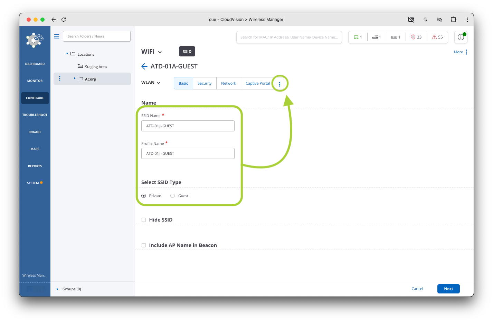

5. Click the 3 dots and select `Access Control` tab and configure using the settings below

    ???+ example "SSID Access Control Settings"

        | Setting                               |           Value           | Notes                                     |
        | ------------------------------------- | :-----------------------: | ----------------------------------------- |
        | **Client Authentication**             |  :octicons-checkbox-16:   |                                           |
        | Authentication Type                   | Radius MAC Authentication |                                           |
        | **RadSec**                            |  :octicons-checkbox-16:   |                                           |
        | Authentication Server                 |         `AGNI-01`         | AGNI Radsec Server was configured already |
        | Accounting     Server                 |         `AGNI-01`         |                                           |
        | **Role Based Control**                |  :octicons-checkbox-16:   |                                           |
        | Rule Type                             |    802.1X Default VSA     |                                           |
        | Operand                               |           Match           |                                           |
        | Assign Role                           |        Select All         | Created in previous section               |
        | Send DHCP Options and HTTP User Agent |  :octicons-checkbox-16:   |                                           |

    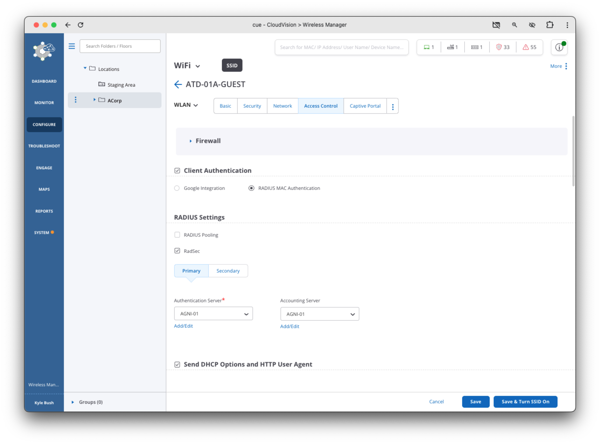

    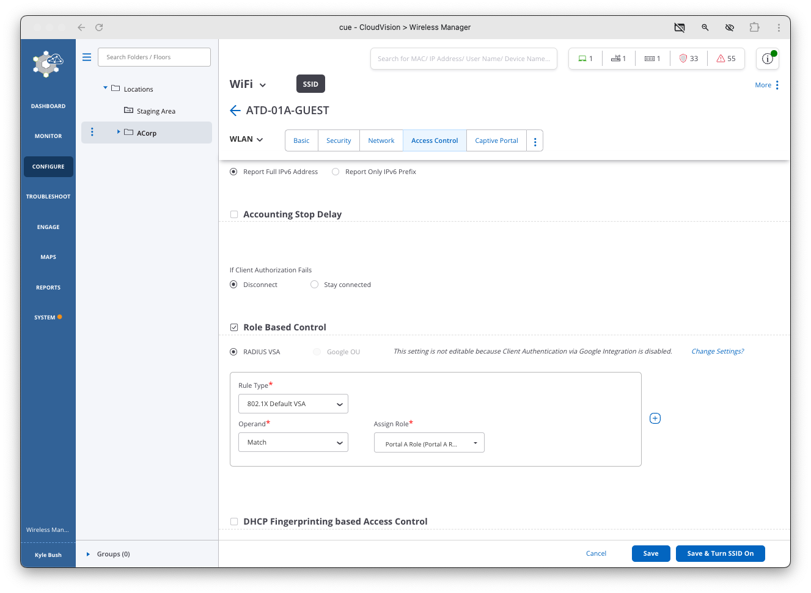

6. Once all settings have been set, Click the `Save & Turn SSID On` button at the bottom of the page.
7. You will be prompted to customize before enabling, select the `5 GHz` option on the next screen (un-check the `2.4 GHz` box if it’s checked), then click `Turn SSID On`.

    

8. Join the new wifi and verify connectivity in CUE and AGNI

    !!! tip "Join the guest Wifi!"

        Give it a moment for the new SSID to come up, but once it's up try and join the wifi! You should be prompted with a captive portal, click on the a

    === "CV-CUE"

        Navigate to `Monitor > Clients` in CV-CUE

        { width="500" }

    === "AGNI"

        Navigate to `Sessions` in AGNI

        { width="500" }

9. Lab section complete.

## WIPS Wireless Intrusion Prevention System

Arista Wireless Intrusion Prevention System (WIPS) leverages RF broadcast and protocol properties including packet formats like probe requests and beacons common to all 802.11 standards(including 802.11ac and 802.11ax) to detect and prevent unauthorized access.

!!! info "More Information"

    For more information about how Arista’s WIPS feature works, refer to this whitepaper: https://www.arista.com/assets/data/pdf/Whitepapers/Arista-Marker-Packet-Whitepaper.pdf

Wi-Fi threats include an ever changing landscape of vulnerabilities, such as:

- :octicons-x-circle-fill-12: Rogue APs
- :octicons-x-circle-fill-12: Unauthorized BYOD Client
- :octicons-x-circle-fill-12: Misconfigured APs
- :octicons-x-circle-fill-12: Client misassociation
- :octicons-x-circle-fill-12: Unauthorized association
- :octicons-x-circle-fill-12: Ad-hoc connections
- :octicons-x-circle-fill-12: Honeypot AP or evil twin “Pineapple”
- :octicons-x-circle-fill-12: AP MAC spoofing
- :octicons-x-circle-fill-12: DoS attack
- :octicons-x-circle-fill-12: Bridging client

### Configure WIPS

Let's go ahead and configure WIPS on our Access Point

1. In the menu on the left hand side of the screen, navigate to `Monitor > WIPS`
2. Click on `Access Points` and `Clients` in the menu at the top of the screen and explore if any Rogue APs or Clients are connected to other APs in the area.
3. Access points that have been detected by WIPS but are not managed within Arista CV-CUE, they are designated as Rogue or External Access Points.
4. Next, let’s explore the information we can gather about the wireless environment using Arista’s WIPS.
5. Select `Monitor > WIPS`
6. In the simple lab environment, only your pod’s single AP is part of your managed wireless infrastructure. All of the other access points and clients on the network are like crowded neighbors or businesses in a shared office work space.
7. Under Monitor, WIPS, Access Points you can see all of the detected Rogue Access points. From this screen you can reclassify, set auto-prevention, add to ban list, name or move the AP.

    !!! info "Additional Information"

        Additional information about WIPS AP classification and [Wireless Intrusion Prevention Techniques](https://www.arista.com/en/ug-cv-cue/cv-cue-wireless-intrusion-prevention-techniques)

- :material-access-point:{ .lg .middle } **Authorized APs**

    ---

    Access Points (APs) that are wired to the corporate network and are compliant with the Authorized Wireless LAN (WLAN) configuration defined by the Administrator in CV-CUE are classified as Authorized APs. Typically, these will be Arista APs, but the administrator can configure the Authorized WiFi policies for any AP vendors.

- :material-access-point-network-off:{ .lg .middle } **Rogue Access Point**

    ---

    APs that are wired to the corporate network and do not follow the Authorized WiFi configuration defined in CV-CUE are classified as Rogue APs.

    Even if this AP is disconnected from the network, it will continue to be classified as a Rogue. These APs are a potential threat to the corporate environment and can be used for intrusion into the corporate network over Wi-Fi. It is recommended to enable Intrusion Prevention for Rogue APs so that Wi-Fi communication with these APs is always disrupted. Using the Location Tracking ability of Arista WIPS, Rogue APs should be tracked down and physically removed from the network.
    Rogue APs are displayed in Red rows on the console.

- :material-access-point-minus:{ .lg .middle } **External Access Point**

    ---

    APs that are not wired to your corporate network are classified as External APs.
    Through the connectivity tests performed by the WIPS Sensors, Wireless Manager is able to determine that these APs are not connected to the wired network. These are neighboring APs that share the same spectrum as the Authorized APs and may cause interference with your Authorized WLAN. A site survey and channel optimization should be performed to reduce radio interference from the External APs. These APs are not always a threat and hence they should not be quarantined/prevented by default, as it would disrupt neighboring Wi-Fi activity. Intrusion Prevention policies can be configured to prevent Authorized clients from connecting to External APs.

    A Rogue Access point can be reclassified, moved or named from the 3-dots menu for each detected AP.

    Within an existing campus WiFi environment or one with a mix of wireless solutions, these discovered APs can be explicitly allowed to show the most accurate security profile.

    For this lab you do not need to authorize any APs.

### Classify and Prevent Individual client

Next, let’s use the WIPS system to identify and prevent an example problematic client from connecting to your network.

1. Navigate to `WIPS > Clients`
2. Find your smartphone device connected to the previous PSK SSID. Reconnect if it has been disconnected.
3. Since this client is associated with the correct PSK for the SSID, it is automatically classified as `Authorized`.
4. Next, click the 3-dots menu for the device, `Change Classification`, `Rogue`
5. Now, sort the clients menu by Classification column (left) and find the red marked Rogue device.
6. Next, Select the 3-dots menu for the Rogue client and click “Prevent This Device”
7. Click Prevent to start the WIPS prevention mechanism to disrupt the selected client from sending and receiving traffic.
8. Try to connect to a public website with your test client device with the prevention setting enabled versus disabled (be sure to disable backup wireless/LTE radios).
9. The test device should fail to connect to other devices through the protected WiFi network when prevention is active.
10. When you are finished, STOP the client prevention

    !!! danger "STOP Client Protection"
        🛑 When you are finished, **STOP** the client prevention so that you can use this test device in upcoming labs, optionally. 🛑

--8<-- "includes/abbreviations.md"
