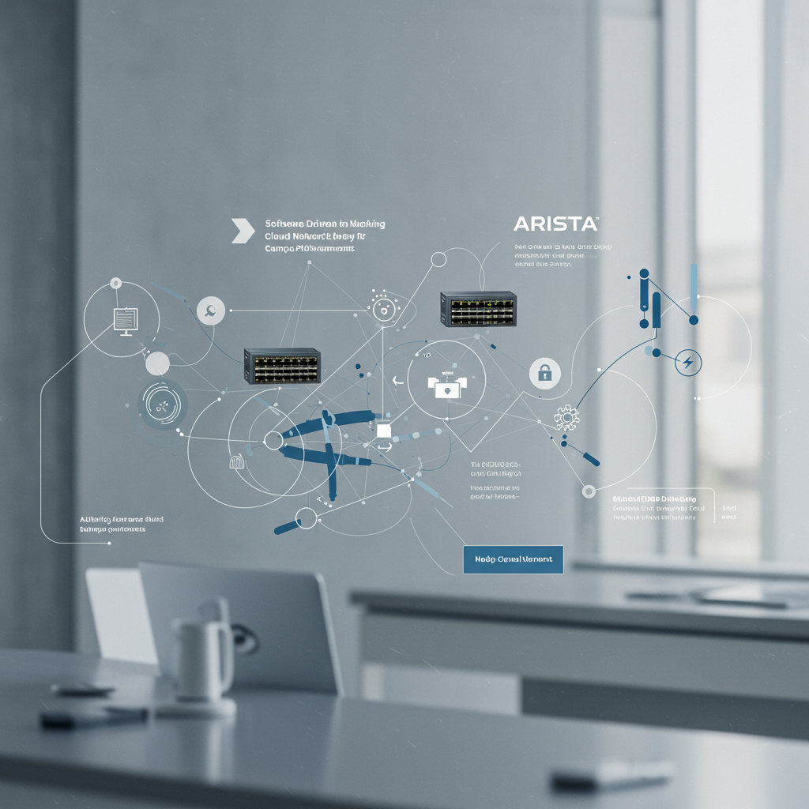

# Arista Campus Workshop

Welcome to our Arista hands-on campus workshop! 🚀

We appreciate your desire to explore our campus ecosystem! Over the next two days, you'll have the opportunity to work with real hardware and software, just as it's deployed in the field. Each lab is designed to simulate real-world scenarios, giving you practical experience. Whether you're troubleshooting devices, configuring switches, or working with our software, you'll gain a better understanding of the campus lifecycle. Get ready to dive in, experiment, and learn by doing!

- :material-file-document-multiple:{ .lg .middle } **Lab Access**

    ---

    How to get logged into the lab

    [:material-login: Let's get started!](./lab_access.md){ .md-button .md-button--primary }

## Wired Guides

- :cloudvision: **A01-Lab: Day 1 Wired Deployment**

    ---

    Get started with onboarding new Arista EOS switches using ZTP, CloudVision, and our Campus Studios.

    [:material-login: Hop into A-01](./wired/a01_lab.md){ .md-button .md-button--primary }

- :cloudvision: **A02-Lab: Day 2 Wired Deployment**

    ---

    Continue with day 2 operations, using CloudVision to manage campus port profiles, access port configuration, and streamlined task execution.

    [:material-login: Hop into A-02](./wired/a02_lab.md){ .md-button .md-button--primary }

- :cloudvision: **A03-Lab: Day 2 Operations and Troubleshooting**

    ---

    The campus is deplopyed, explore the CloudVision observability, altering, troubleshooting, and more!

    [:material-login: Hop into A-03](./wired/a03_lab.md){ .md-button .md-button--primary }

## Wireless Guides

- :cloudvision: **B01-Lab: Day 1 Wifi Deployment**

    ---

    Deploy and explore the deployment of new APs in the environment using CV-CUE

    [:material-login: Hop into B-01](./wired/b01_lab.md){ .md-button .md-button--primary }

- :cloudvision: **B02-Lab: Wifi and WIPS**

    ---

    Configure Wifi and WIPS

    [:material-login: Hop into B-02](./wired/b02_lab.md){ .md-button .md-button--primary }

- :cloudvision: **B03-Lab: Smart System Upgrade (SSU)**

    ---

    Using Arista EOS Smart System Upgrade (SSU) we can avoid downtime when upgrading our wired network!

    [:material-login: Hop into B-03](./wired/b03_lab.md){ .md-button .md-button--primary }

## Security Guides

- :cloudvision: **C01-Lab: Day 1 Wifi Deployment**

    ---

    Deploy and explore the deployment of new APs in the environment using CV-CUE

    [:material-login: Hop into C-01](./wired/c01_lab.md){ .md-button .md-button--primary }

- :cloudvision: **C02-Lab: Wifi and WIPS**

    ---

    Configure Wifi and WIPS

    [:material-login: Hop into C-02](./wired/c02_lab.md){ .md-button .md-button--primary }

- :cloudvision: **C03-Lab: Smart System Upgrade (SSU)**

    ---

    Using Arista EOS Smart System Upgrade (SSU) we can avoid downtime when upgrading our wired network!

    [:material-login: Hop into C-03](./wired/c03_lab.md){ .md-button .md-button--primary }

--8<-- "includes/abbreviations.md"
