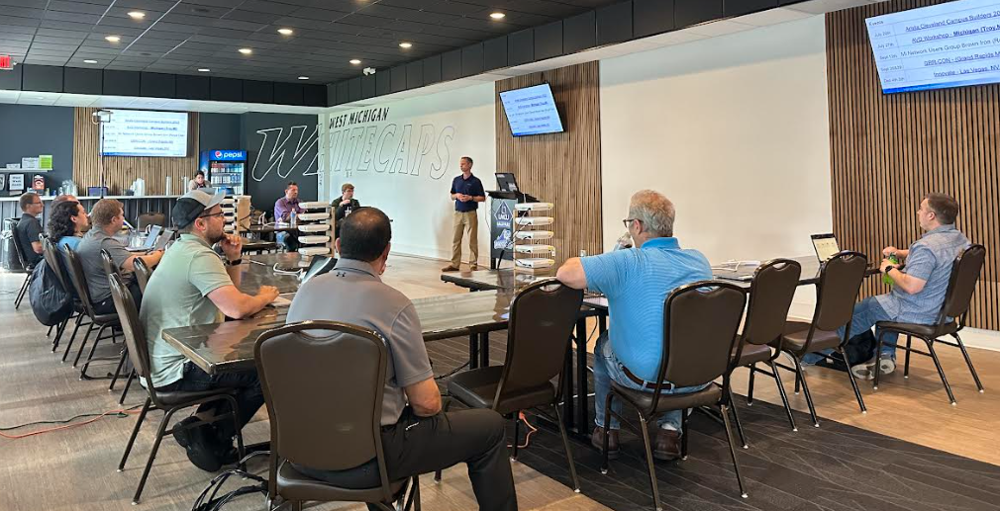
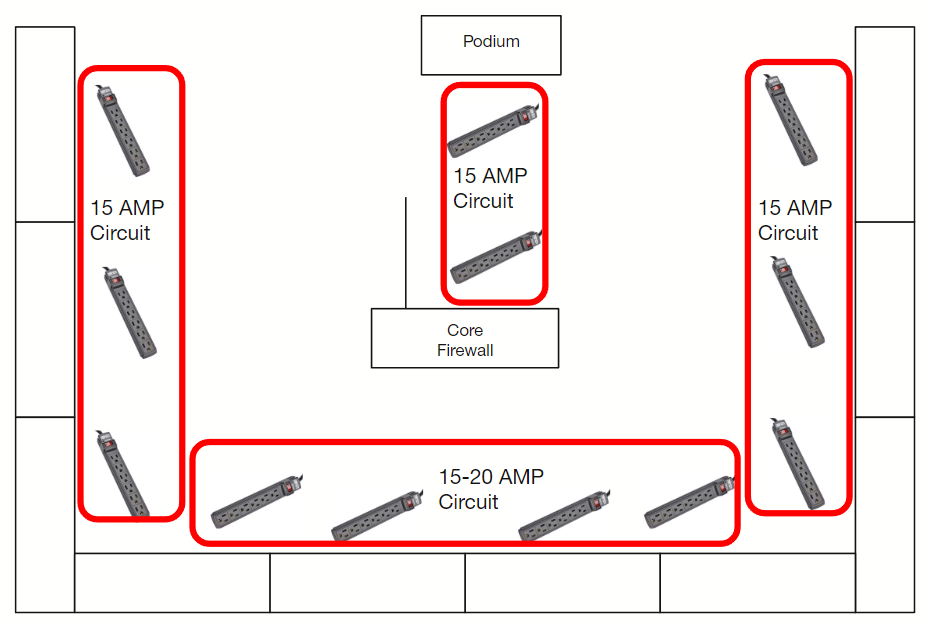
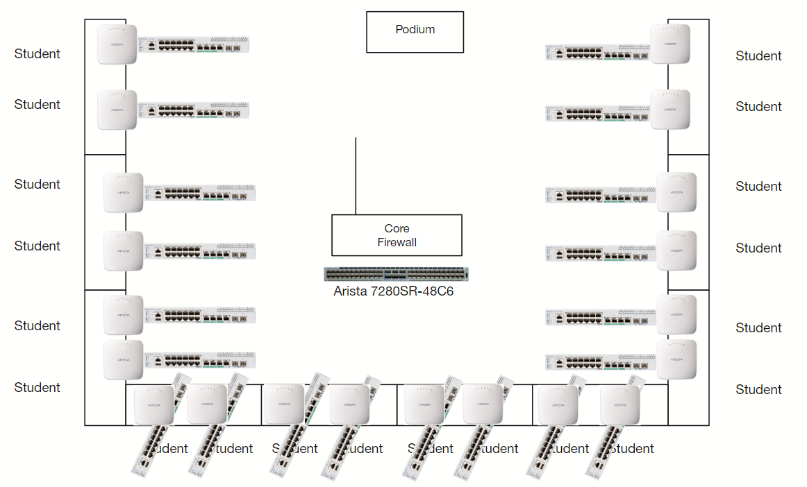

# Event Guide & Marketing

## Overview

The purpose of this document is to help guide you through planning, marketing, and the venue requirements.

## Event Overview

We are very excited for this campus event. The vision is to have a two day Campus event in order to teach and provide students with hands-on access to CV-CUE, CVaaS and AGNI.  

We will have CV-CUE for wireless and CVaaS for switches.  Each student will have a C-230 and a 710P switch to configure.  Each student will use their laptop to configure their devices.  Hopefully each student can bring a tablet as well to view the lab guides.  We will then utilize devices and create policies in AGNI for each student.

Having CV-CUE, CVaaS, and AGNI instances gives us the flexibility to host multiple levels of training to tailor to our attendees.  We will have the students build out Wired and Wireless segments in AGNI.  

We really want to show the strength of our Campus portfolio.

## Event Limitations

This hands on Arista Test Drive has some limitations.  Typically we like to announce to as wide of an audience as possible.  However, with this event we only have 20 lab kits.  Therefore, we are limited to 20 students. It is possible for a few students from the same company to share a lab kit.

## Venue Requirements

In order to have a successful event there are a couple of requirements. Here are a few samples from recent events.

### Event Setup

1. Typical event room size:  50’ x 60’

 - **Example 1**
 
    ---

    { width="400" }

 - **Example 2**

    ---

    { width="400" }

1. Setup of the tables, podium, powerstrips and lab equipment can be seen below

=== "Table Setup"

    10 - 6’ Tables set up in a U shape with a table in the center.

    

=== "Power Strips"

    At least 12 Power Strips are needed. Recommended 4 sets of circuits.

    

=== "Lab Equipment"

    Event Hardware setup

    

## Connectivity

The following items will need to be verified by the local SE prior to scheduling the event. 

1. Hard wired ethernet with an internet connection.
2. Port requirements are met (see [port requirements])

### Port Requirements

- { .lg .middle width="24"} **CV-CUE**

    ---

    **Ports**: TCP 443, UDP 3851

    **DNS**: redirector.online.spectraguard.net

- :cvp:{ .lg .middle .arista } **CVaaS**

    ---

    **Ports**: N/A

    **DNS**: cv-staging.corp.arista.io

- :agni:{ .lg .middle .arista } **AGNI**

    ---

    **Ports**: TCP 2083, UDP 2083

    **DNS**: redirector.online.spectraguard.net

### Ports Used by APs

| Destination Address                        | Protocol | Port(s)          | Direction | Comment                        |
| ------------------------------------------ | -------- | ---------------- | --------- | ------------------------------ |
| https://redirector.online.spectraguard.net | TCP      | 443              | Outbound  | Cloud Connectivity             |
| https://awm-XXX.srv.wifi.arista.com        | TCP      | 80/443           | Outbound  | Cloud Connectivity/AP Upgrades |
| https://awm-XXX.srv.wifi.arista.com        | UDP      | 3852             | Outbound  | CIP Only (no proxy support)    |
| https://devices.srv.wifi.arista.com        | TCP      | 443              | Outbound  | Upgrades                       |
| Local Services                             | UDP      | 53/67/68/123/514 | Outbound  | DNS/DHCP/NTP/Syslog            |
| Local Services                             | UDP      | 1812/1813        | Outbound  | Radius                         |
| Local Services                             | UDP      | 3799             | Inbound   | Radius COA                     |
| Local Services                             | TCP      | 2083             | Outbound  | Radsec [AGNI](agni.arista.io)  |

??? example "List of redirector IPs"

    | Redirector                         | IP Address     |
    | ---------------------------------- | -------------- |
    | redirector.online.spectraguard.net | 34.194.204.153 |
    | redirector.online.spectraguard.net | 52.64.207.242  |
    | redirector.online.spectraguard.net | 13.52.28.201   |
    | redirector.online.spectraguard.net | 52.56.61.130   |
    | redirector.online.spectraguard.net | 52.58.63.144   |
    | redirector.online.spectraguard.net | 34.194.16.66   |
    | redirector.online.spectraguard.net | 44.195.112.68  |
    | redirector.online.spectraguard.net | 3.228.242.60   |
    | redirector.online.spectraguard.net | 35.154.33.182  |
    | redirector.online.spectraguard.net | 52.8.155.239   |
    | redirector.online.spectraguard.net | 52.203.51.183  |
    | redirector.online.spectraguard.net | 15.206.10.168  |
    | redirector.online.spectraguard.net | 13.113.247.134 |
    | redirector.online.spectraguard.net | 52.29.194.192  |
    | redirector.online.spectraguard.net | 3.11.192.175   |
    | redirector.online.spectraguard.net | 52.199.251.150 |

## Marketing Examples

- :material-email:{ .lg .middle .arista } **Arista Campus Roadshow - 2 Day Event**

    ---

    Hands-On Labs with Physical Gear
    
    **Day 1:** April 16th -  11:30 AM - 5:00 PM EST | Dublin, OH
    
    **Day 2:** April 17th -  9:00 AM - 4:00 PM EST | Dublin, OH

    **Where:**  OCLC Conference Center - Lakeside Room, 6600 Kilgour Pl, Dublin, OH 43017 

    **Requirements:**

    For student participation at this event there are a few requirements:
        
      - [x] Laptop with Ethernet adapter
      - [x] Secondary device to view Lab Guides (optional)
      - [x] Additional Devices for Wired/Wireless 802.1x (optional)

    **Summary:**

    Arista Networks invites you to learn how Software Driven Cloud Networking turns bare-metal infrastructure into a fully integrated platform to deliver a robust and effective Campus solution for your organization. This technical event will feature software and hardware roadmaps, with hands-on lab exercises, as well as technical discussion topics and industry trends in the Campus. Attendees will have access to configure our Campus management platforms of CV-CUE, CVaaS, and AGNI, as well have access to their own switch and access point.
    
    **Day 1**

      - Campus Wired and Wireless Solutions
      - CVaaS Overview / Features and Demo / Hands-on Labs
      - Wireless Overview / Features and Demo / Hands-on Labs
    
    **Day 2**
    
      - AGNI NAC Overview / Features and Demo / Hands-on Labs
    
    **Hardware Provided**
    
      - 710P-16P POE switch
      - C-230 WiFi 6 Access Point

## Welcome Letter

To only be sent to the attendees at the event.  This will include the link to the lab guides.

!!! quote "Welcome Letter"

    Hi All!
    
    Thank you so much for your time and your participation!
    
    **Event WiFi Access:** TBD

    **SSID:** Arista_WiFi

    
    Here is the link to the documents and Lab Guides that we will cover, as well as CV-CUE, AGNI, and CVaaS Access
      
      - Lab Guides: https://aristanetworks.egnyte.com/fl/XXNaYsjahq/CampusRoadshow_
      - Use your personal assigned email address to log into the applications.
      - CV-CUE / AGNI Access: https://launchpad.wifi.arista.com/
        
        { width="300" }

      - CVaaS Access: https://www.arista.io/

        { width="300" }

    ---

    If you have any questions or would like to have your own Arista POC just let us know.

    { width="300" align="right"}

    **Sales Team**

    - Bob Fenner - Regional Sales Director, Ohio Valley - bobf@arista.com
    - Kevin Sullivan - Account Manager - Sully@arista.com
    - Dave Fröhlich - Account Manager - dfro@arista.com
    - Jeremy Limardi - Account Manager - jlimardi@arista.com

    **Presentors**

    - Matthew Bielecki - Systems Engineer - mbielecki@arista.com
    - Scott Schafer - Systems Engineer - sschafer@arista.com
    - Brendan Gillis - Advanced Services Engineer - bgillis@arista.com
    - Jared Scaife - Advanced Services Engineer - jscaife@arista.com
    - Mark Thiel - Advanced Services Engineer - mthiel@arista.com

    ---

    Thanks,

    Arista Team