# Intangi Iris Configuration Tool

## Overview

This lab is intended to use the Campus Workshop to showcase how to configure Arista campus . Authorized Arista partners are able to download and access the tool at intangi.com/support website. Partners are required to login with their corporate email address. Contact iris-help-ext@arista.com for assistance. There are many online resources available which includes videos, documentation, and more at [intangi.com/support](https://intangi.com/support).

## Iris Dashboard
Upon successfully logging in, you will be presented with the Iris dashboard. Click on the Arista catalog to begin

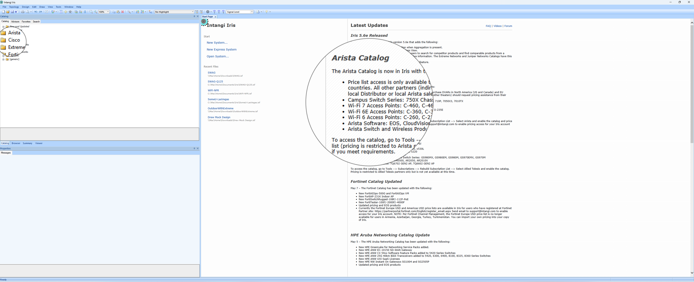

### Arista Catalog at a glance
Expand the catalog to view the various devices and features available

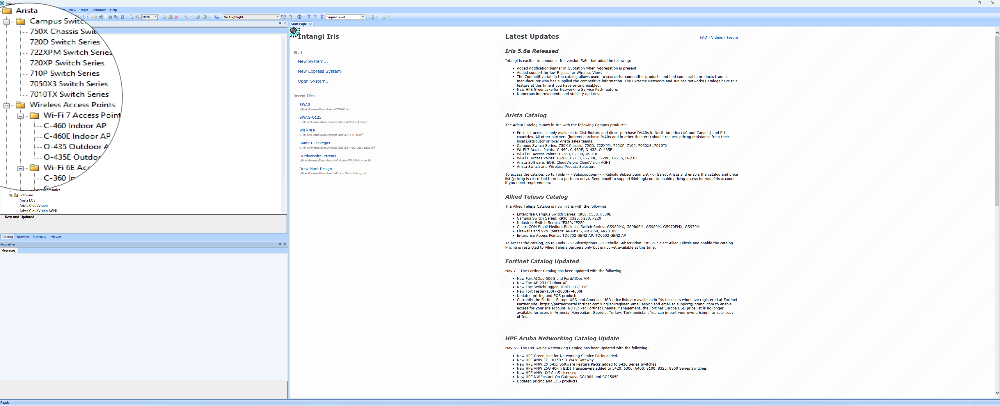

You are now ready to create a new network design.

1. Under the `Start` section, click on `New System`
Provide a name for your system, accept all defaults and click `OK.

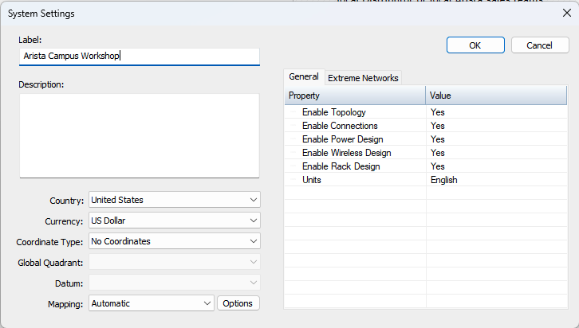

2. Select the Arista price list.
Navigate to Tools on the horizontal menu bar, select `Subscriptions` then select `Manage Subscriptions`. Select the `Arista` price list and click `Enable`. Optionally click on `Price Lists` to view the price list details. USD and EUR price lists are available. Click `OK` to continue.

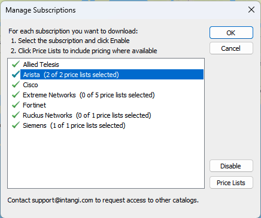

3. Create a new site.
Navigate to `Sites` and click on `New Site`. Provide a name for your site, select the desired `Power`. `Contact`, `Description` are optional and click `OK` continue. Double-click on your workshop name on the map. A clean worshop space will be provided.

4. Choose a desired spine switch from the catalog. Double-click on the `7050X Switch Series`, select one of the pre-configured `7050SX3-24YC2-F` bundles. `-F` is with front-to-back fan trays, `-R` is rear-to-front. Cut-and-paste the device on the site workspace to build a two-switch spine network layer.

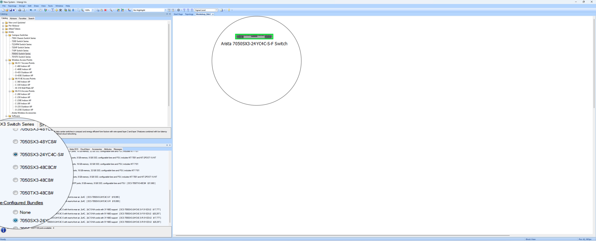

5. Interconnect the spine switches using the `Connect` tool. Select the spine switch and then the other spine switch. Choose the 100G DAC interface for the connection. We are pre-configuring the spine switches with MLAG
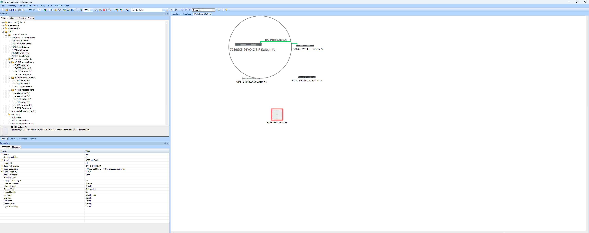

Edit the quantity multipler of 100G DAC to `2`

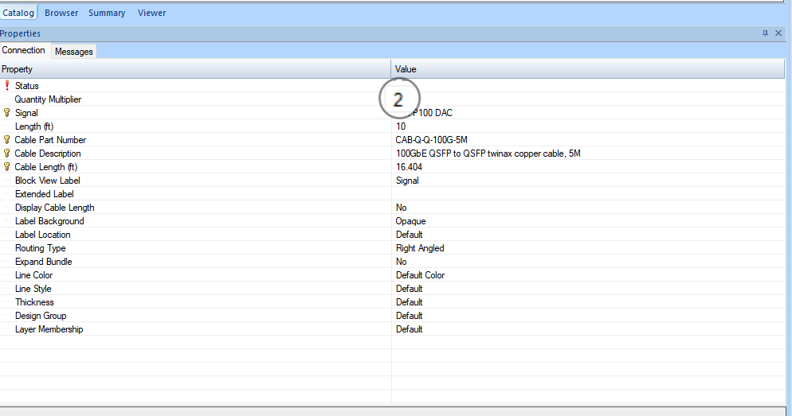

6. Using the same method of choosing the right Arista products for your design, select `720XP-48ZC2` POE switches for the leaf layer. Add two switches for each leaf layer.

7. Connect the spine and leaf layer together using the `Connect` tool. Select the spine switch and then the leaf switch. Repeat for the second leaf switch.

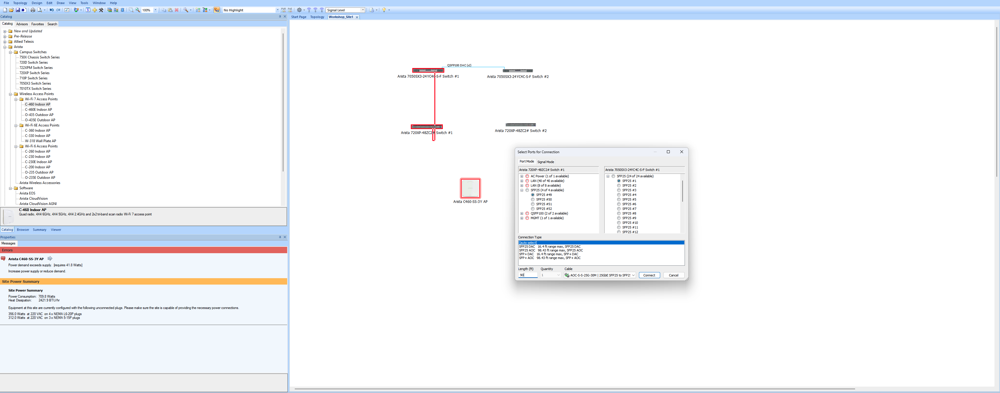
8. Add an wireless access point to the leaf layer. Double-click on the `Wireless Access Points` and select the `C-406` WiFi7 model. Cut-and-paste the device on the site workspace to build a two-switch active-active wireless layer.

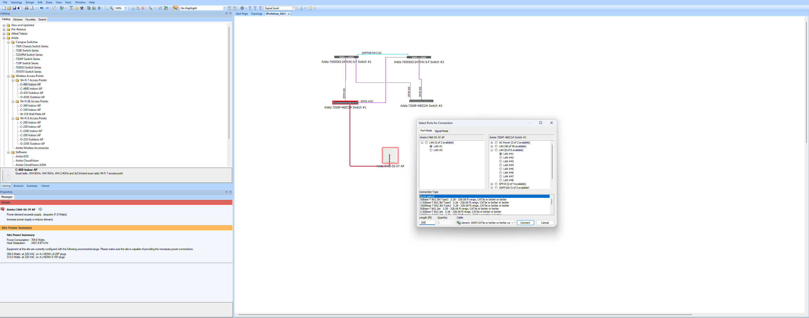

9. Connect the wireless access point to the leaf layer using the `Connect` tool. Select the leaf switch and then the wireless access point.

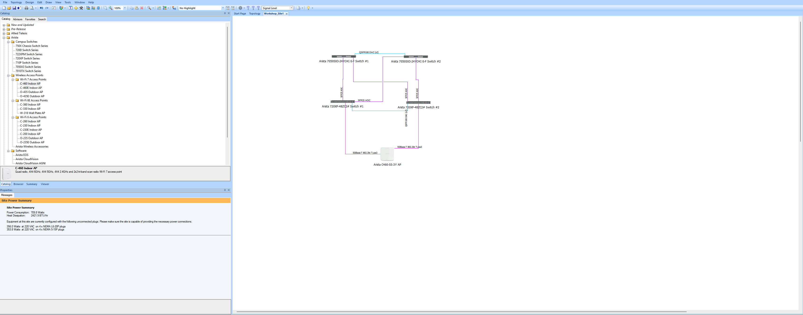

### Create a Bill Of Material (BOM)

Iris can generate a Bill Of Material (BOM) for your design. This can be used to order the hardware and software for your design.

1. Navigate to `Quotation` or press `Ctrl+Q`
2. The `Quotation Composite View` will appear.  You can see the devices and features selected for your design.  You can also see the price for each device and feature.  The total price is also displayed. Hover your cursor over the `Export menu` and select `Export to Excel` to download the BOM.

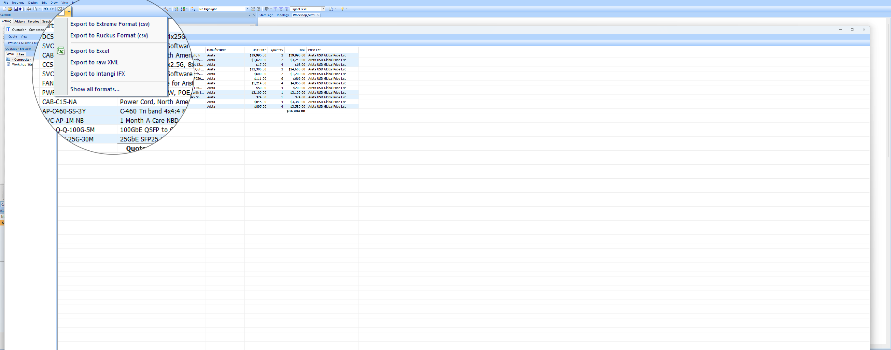

!!! tip "🎉 CONGRATS! You have completed the Iris labs! 🎉"

--8<-- "includes/abbreviations.md"