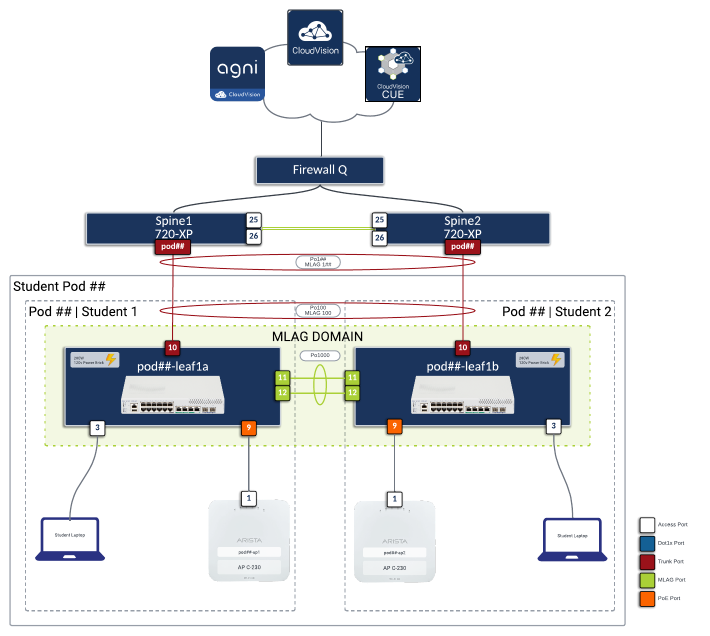

# Atlanta Lab Assignment - November 11-12, 2025

## Access Points and Switches Serial Numbers

| Email | AP#1 | AP#2 | Switch |
|:------|:----:|:----:|:------:|
| dane.newman@ahead.com | - | - | - |
| charles.hall@ahead.com | - | - | - |
| apsmith@cspire.com | - | - | - |
| cjones@udtonline.com | - | - | - |
| jfowler@udtonline.com | - | - | - |
| sgrainger@adapture.com | - | - | - |
| bryan.deverell@cumberland.com | - | - | - |
| erick.sanchez@cumberland.com | - | - | - |
| wallace.pederson@computacenter.com | - | - | - |
| dan.crews@computacenter.com | - | - | - |
| jpucciariello@bulloch.solutions | - | - | - |
| jbryant@bulloch.solutions | - | - | - |
| stephen.norton@nwn.ai | - | - | - |
| cgordon@dgrsystems.com | - | - | - |
| - | - | - | - |
| - | - | - | - |
| - | - | - | - |
| - | - | - | - |
| - | - | - | - |
| mbalagot+cws@arista.com | - | - | - |

## Student and Pod Assignment with ATD Access

!!! tip "ATD Token Access"
    Click the 🚀 **ATD Lab** links below to access your Arista Test Drive topology.
    Each link will open in a new browser tab for easy access.

| Email | Lab Assignment | Student Pod # | CV-CUE ATN | ATD Token |
|:------|:-------------:|:-------------:|:----------:|:---------:|
| dane.newman@ahead.com | student1 | pod01 | ATN570829 | [🚀 ATD Lab](https://testdrive.arista.com/topology?topo=eyJpbnN0YW5jZSI6ICJhdGxhbnRhLWFjd3MtMS03ZTA4ZWYwMyIsICJ0b3BvbG9neSI6ICJjYW1wdXMifQ==){:target="_blank"} |
| charles.hall@ahead.com | student2 | pod02 | ATN570830 | [🚀 ATD Lab](https://testdrive.arista.com/topology?topo=eyJpbnN0YW5jZSI6ICJhdGxhbnRhLWFjd3MtMi03ZTA4ZWYwMyIsICJ0b3BvbG9neSI6ICJjYW1wdXMifQ==){:target="_blank"} |
| apsmith@cspire.com | student3 | pod03 | ATN570831 | [🚀 ATD Lab](https://testdrive.arista.com/topology?topo=eyJpbnN0YW5jZSI6ICJhdGxhbnRhLWFjd3MtMy03ZTA4ZWYwMyIsICJ0b3BvbG9neSI6ICJjYW1wdXMifQ==){:target="_blank"} |
| cjones@udtonline.com | student4 | pod04 | ATN570832 | [🚀 ATD Lab](https://testdrive.arista.com/topology?topo=eyJpbnN0YW5jZSI6ICJhdGxhbnRhLWFjd3MtNC03ZTA4ZWYwMyIsICJ0b3BvbG9neSI6ICJjYW1wdXMifQ==){:target="_blank"} |
| jfowler@udtonline.com | student5 | pod05 | ATN570833 | [🚀 ATD Lab](https://testdrive.arista.com/topology?topo=eyJpbnN0YW5jZSI6ICJhdGxhbnRhLWFjd3MtNS03ZTA4ZWYwMyIsICJ0b3BvbG9neSI6ICJjYW1wdXMifQ==){:target="_blank"} |
| sgrainger@adapture.com | student6 | pod06 | ATN570834 | [🚀 ATD Lab](https://testdrive.arista.com/topology?topo=eyJpbnN0YW5jZSI6ICJhdGxhbnRhLWFjd3MtNi03ZTA4ZWYwMyIsICJ0b3BvbG9neSI6ICJjYW1wdXMifQ==){:target="_blank"} |
| bryan.deverell@cumberland.com | student7 | pod07 | ATN570835 | [🚀 ATD Lab](https://testdrive.arista.com/topology?topo=eyJpbnN0YW5jZSI6ICJhdGxhbnRhLWFjd3MtNy03ZTA4ZWYwMyIsICJ0b3BvbG9neSI6ICJjYW1wdXMifQ==){:target="_blank"} |
| erick.sanchez@cumberland.com | student8 | pod08 | ATN570836 | [🚀 ATD Lab](https://testdrive.arista.com/topology?topo=eyJpbnN0YW5jZSI6ICJhdGxhbnRhLWFjd3MtOC03ZTA4ZWYwMyIsICJ0b3BvbG9neSI6ICJjYW1wdXMifQ==){:target="_blank"} |
| wallace.pederson@computacenter.com | student9 | pod09 | ATN570837 | [🚀 ATD Lab](https://testdrive.arista.com/topology?topo=eyJpbnN0YW5jZSI6ICJhdGxhbnRhLWFjd3MtOS03ZTA4ZWYwMyIsICJ0b3BvbG9neSI6ICJjYW1wdXMifQ==){:target="_blank"} |
| dan.crews@computacenter.com | student10 | pod10 | ATN570838 | [🚀 ATD Lab](https://testdrive.arista.com/topology?topo=eyJpbnN0YW5jZSI6ICJhdGxhbnRhLWFjd3MtMTAtN2UwOGVmMDMiLCAidG9wb2xvZ3kiOiAiY2FtcHVzIn0=){:target="_blank"} |
| jpucciariello@bulloch.solutions | student11 | pod11 | ATN570839 | [🚀 ATD Lab](https://testdrive.arista.com/topology?topo=eyJpbnN0YW5jZSI6ICJhdGxhbnRhLWFjd3MtMTEtN2UwOGVmMDMiLCAidG9wb2xvZ3kiOiAiY2FtcHVzIn0=){:target="_blank"} |
| jbryant@bulloch.solutions | student12 | pod12 | ATN570840 | [🚀 ATD Lab](https://testdrive.arista.com/topology?topo=eyJpbnN0YW5jZSI6ICJhdGxhbnRhLWFjd3MtMTItN2UwOGVmMDMiLCAidG9wb2xvZ3kiOiAiY2FtcHVzIn0=){:target="_blank"} |
| stephen.norton@nwn.ai | student13 | pod13 | ATN570841 | [🚀 ATD Lab](https://testdrive.arista.com/topology?topo=eyJpbnN0YW5jZSI6ICJhdGxhbnRhLWFjd3MtMTMtN2UwOGVmMDMiLCAidG9wb2xvZ3kiOiAiY2FtcHVzIn0=){:target="_blank"} |
| cgordon@dgrsystems.com | student14 | pod14 | ATN570842 | [🚀 ATD Lab](https://testdrive.arista.com/topology?topo=eyJpbnN0YW5jZSI6ICJhdGxhbnRhLWFjd3MtMTQtN2UwOGVmMDMiLCAidG9wb2xvZ3kiOiAiY2FtcHVzIn0=){:target="_blank"} |
| - | student15 | pod15 | - | [🚀 ATD Lab](https://testdrive.arista.com/topology?topo=eyJpbnN0YW5jZSI6ICJhdGxhbnRhLWFjd3MtMTUtN2UwOGVmMDMiLCAidG9wb2xvZ3kiOiAiY2FtcHVzIn0=){:target="_blank"} |
| - | student16 | pod16 | - | [🚀 ATD Lab](https://testdrive.arista.com/topology?topo=eyJpbnN0YW5jZSI6ICJhdGxhbnRhLWFjd3MtMTYtN2UwOGVmMDMiLCAidG9wb2xvZ3kiOiAiY2FtcHVzIn0=){:target="_blank"} |
| - | student17 | pod17 | - | [🚀 ATD Lab](https://testdrive.arista.com/topology?topo=eyJpbnN0YW5jZSI6ICJhdGxhbnRhLWFjd3MtMTctN2UwOGVmMDMiLCAidG9wb2xvZ3kiOiAiY2FtcHVzIn0=){:target="_blank"} |
| - | student18 | pod18 | - | [🚀 ATD Lab](https://testdrive.arista.com/topology?topo=eyJpbnN0YW5jZSI6ICJhdGxhbnRhLWFjd3MtMTgtN2UwOGVmMDMiLCAidG9wb2xvZ3kiOiAiY2FtcHVzIn0=){:target="_blank"} |
| - | student19 | pod19 | - | - |
| mbalagot+cws@arista.com | student20 | pod20 | ATN570238 | - |

## Topology

## Quick Access Guide

### 🚀 ATD (Arista Test Drive) Access
- **Click any ATD Lab link** in the table above
- **New browser tab** will open with your topology
- **Login** with your provided credentials
- **Start your lab exercises** immediately

### 📧 Support
If you experience any issues with ATD access:
- Verify your internet connection
- Try refreshing the ATD page
- Contact the workshop instructor for assistance
