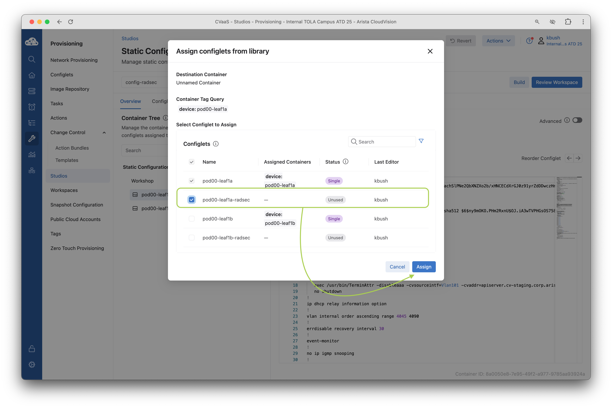
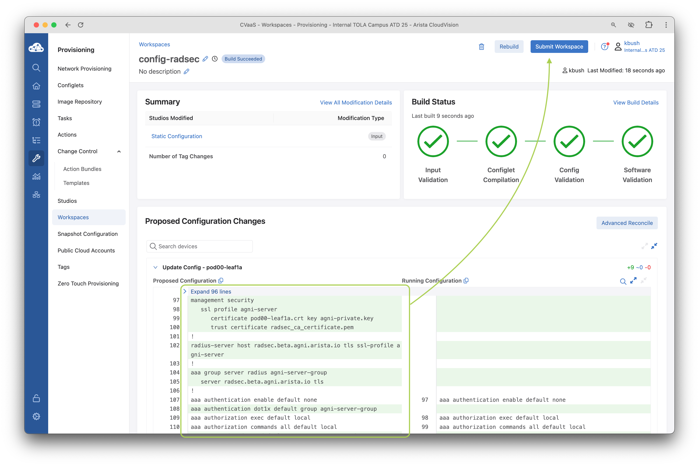
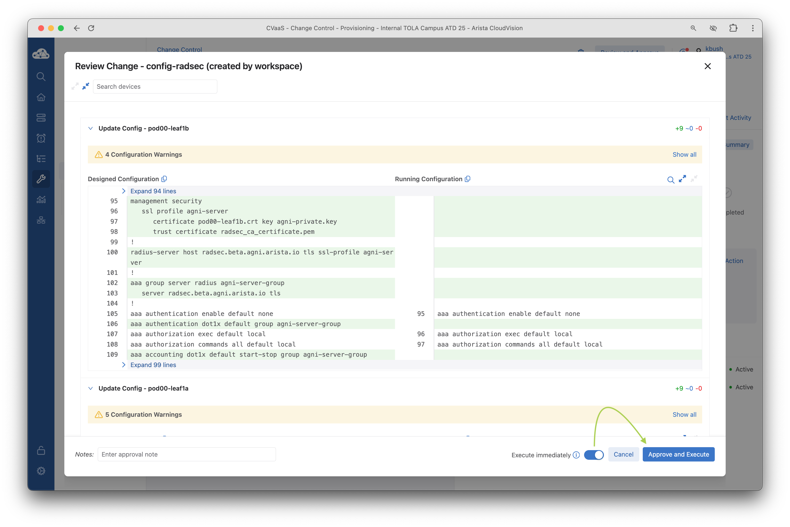
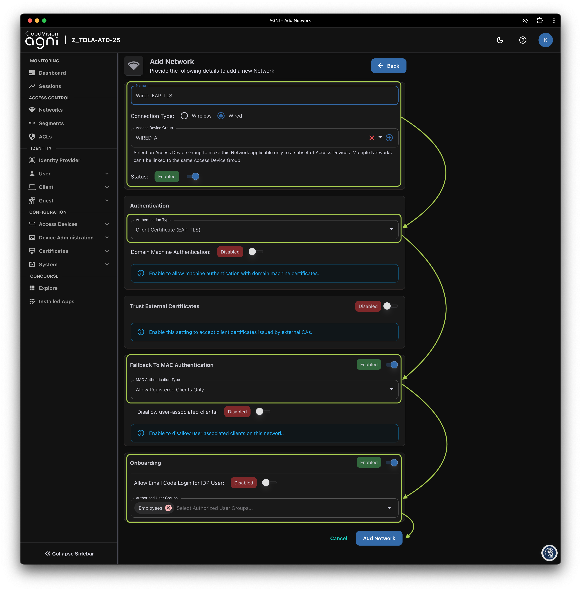
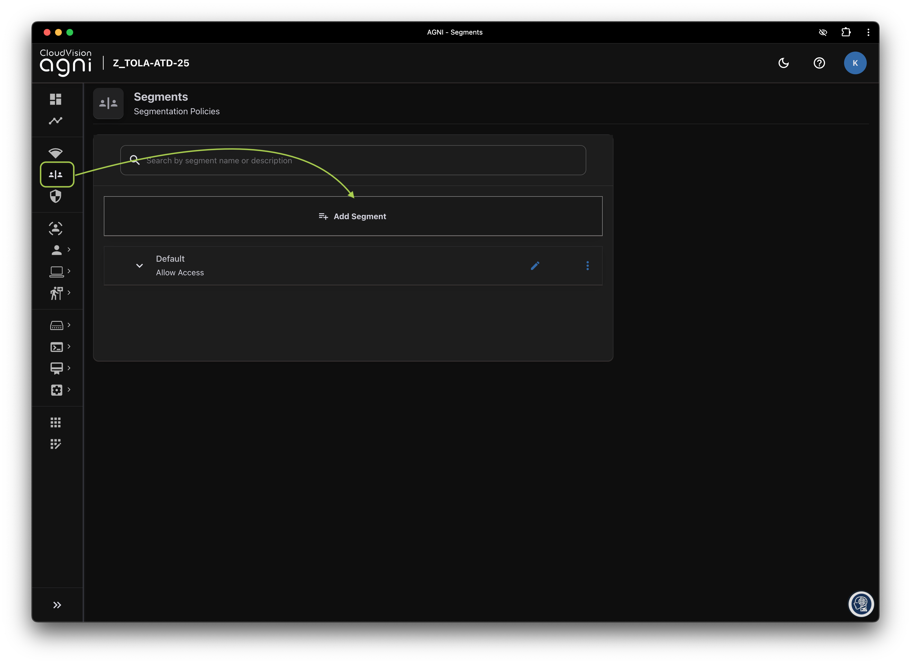

# C-03 | AGNI and Wired EAP-TLS 802.1X

## Overview

In this lab...
--8<--
docs/snippets/topology.md
--8<--

??? tip "Reminder on logging in and creating a workspace"

    --8<--
    docs/snippets/login_cv.md
    docs/snippets/workspace.md
    --8<--

## Enable RadSec

In this lab you will be configuring RadSec on your lab switches by adding the RadSec configuration to the switches via the Static Configuration Studio.

1. Click on the `Provisioning` menu option, then choose `Studios`.
2. Let's open the `Static Configuration Studio`

   

3. Select your respective switch
4. In the `Device Container` window, click on `+ Configlet` followed by `Configlet Library`.

   

5. Select the configlet named for your switch, should be `pod##-leaf1X-radsec` and click `Assign` to add the configlet to the switch

   

6. Click `Review Workspace` to review all the changes proposed to the CloudVision Studio

7. Review the workspace details showing the summary of modified studios, the build status, and the proposed configuration changes for each device. When ready click `Submit Workspace`

    

    ??? "What does this configuration do?!"

        Click below on the lines to understand what each line does

        ```yaml
        !
        management security
            ssl profile agni-server #(1)!
                certificate pod00-leaf1a.crt key agni-private.key #(2)!
                trust certificate radsec_ca_certificate.pem #(3)!
        !
        radius-server host radsec.beta.agni.arista.io tls ssl-profile agni-server #(4)!
        !
        aaa group server radius agni-server-group #(5)!
            server radsec.beta.agni.arista.io tls
        !
        aaa authentication dot1x default group agni-server-group
        aaa accounting dot1x default start-stop group agni-server-group
        !
        ```

        1. Create an SSL profile
        2. This is the switch key and certificate, this certificate was generated on EOS, signed by AGNI, and installed in the store.
        3. This is the trusted certificate downloaded from AGNI and installed on the EOS certificate store
        4. This enabled RadSec on the device, configured to using our SSL profile
        5. Create the AAA radius server group, we use this to enforce client authentication via dot1x later on in this lab

8. Click `View Change Control` and review the Change Control, hit `Review and Approve` when ready.

    

9. Select `Execute immediately` and click `Approve and Execute`

    

10. The change control will execute and apply all the RadSec configuration changes to the device. This will enable RadSec connectivity between the switch and AGNI.

    !!! tip "Automating Certificates"

        The switch and AGNI certs were generated, signed, and installed using automation before hand. Specifically ansible and leveraging both the switch eAPI and AGNI API. You can read more on how this role works [EOS AGNI Radsec (GitHub)](https://github.com/carl-baillargeon/eos_agni_radsec/tree/main)

    

11. See the [Configuring RadSec](../references/radsec.md) in EOS for additional information. You can

--8<--
docs/snippets/login_agni.md
--8<--

## Device Groups

Move device into the device groups.

## Create Wired EAP-TLS Network and Segment

1. Click on `Access Devices > Devices` to confirm the RadSec connection is up.

    

2. In this section we will create a Network and Segment in CloudVision AGNI to utilize a certificate based TLS authentication method on a wired connection with a Raspberry Pi.
3. Click on `Networks` and select `+ Add Network`

    

4. Fill in and select the Following fields on the `Add Network` page.

    ???+ example "Network Settings"

        | Field                          |           Student 1           |           Student 2           |
        | ------------------------------ | :---------------------------: | :---------------------------: |
        | Name                           |         ATD-##A-WIRED         |         ATD-##B-WIRED         |
        | Connection Type                |             Wired             |             Wired             |
        | Access Device Group            |            WIRED-A            |            WIRED-B            |
        | Status                         |            Enabled            |            Enabled            |
        | Authentication type            | Client Certificate (EAP-TLS)  | Client Certificate (EAP-TLS)  |
        | Fallback to mac Authentication |            Enabled            |            Enabled            |
        | MAC Authentication Type        | Allow Registered Clients Only | Allow Registered Clients Only |
        | Onboarding                     |            Enabled            |            Enabled            |
        | Authorized User Groups         |            Arista             |            Arista             |

    

5. When done, click on `Add Network` at the bottom of the screen.
6. Next, click on `Segments` and then `+ Add Segment`

    

7. Configure the network segment with the following settings:

    ???+ example "Segment Settings"

        | Field                          |                           Student 1                           |                           Student 2                           |
        | ------------------------------ | :-----------------------------------------------------------: | :-----------------------------------------------------------: |
        | Name                           |                         ATD-##A-WIRED                         |                         ATD-##B-WIRED                         |
        | Description                    |                         ATD-##A-WIRED                         |                         ATD-##B-WIRED                         |
        | Condition #1                   |                `Network:Name is ATD-##A-WIRED`                |                `Network:Name is ATD-##B-WIRED`                |
        | Condition #2                   | `Network:Authentication Type is Client Certificate (EAP-TLS)` | `Network:Authentication Type is Client Certificate (EAP-TLS)` |
        | Action #1                      |                        `Allow Access`                         |                        `Allow Access`                         |

    

8. Finally, select `Add Segment` at the bottom of the page.

9. You should now be able to expand and review your segment.

    

10. Next, unplug your raspberry Pi from `Ethernet1` and into `Ethernet2` on the switch and click on `Sessions` to see if your ATD Raspberry Pi has a connection via the Wired connection.

    TODO: Get screenshot

    

    !!! note "Client Certificate"

        The Client Certificate has already been applied to the Raspberry Pi.

## Validate and Verify Wired EAP-TLS Device

### AGNI

1. Once the device is connected you will be able to view the status of the connection and additional session details if you click on the Eye to the right of the device.
2. AGNI will then display more in depth session information regarding the device and connection.

### CloudVision Endpoint Overview

Show Endpoint Overview, search for a device on the students pod, sflow will be enabled, should be able to see more info about authentication, traffic flows, and

### EOS CLI

You can also validate the session on the switch by issuing the following commands in the switch CLI

```yaml
show dot1x host
show dot1x host mac d83a.dd98.6183 detail
```

```yaml hl_lines="4 8 10-12"
pod00-leaf1a#show dot1x host
Port      Supplicant MAC Auth  State                   Fallback               VLAN
--------- -------------- ----- ----------------------- ---------------------- ----
Et2       d83a.dd98.6183 EAPOL SUCCESS                 NONE

pod00-leaf1a#show dot1x host mac d83a.dd98.6183 detail
Operational:
Supplicant MAC: d83a.dd98.6183
User name: aristaatd01@outlook.com
Interface: Ethernet2
Authentication method: EAPOL
Supplicant state: SUCCESS
Fallback applied: NONE
Calling-Station-Id: D8-3A-DD-98-61-83
Reauthentication behaviour: DO-NOT-RE-AUTH
Reauthentication interval: 0 seconds
VLAN ID:
Accounting-Session-Id: 1x00000004
Captive portal:
AAA Server Returned:
Arista-WebAuth:
Class: Rcnlkerh9ci3s72u197e0|C4151a596-baab-444b-a4fd-ad40946d8b5f
Filter-Id:
Framed-IP-Address: 192.168.101.21 sourceArp
NAS-Filter-Rule:
Service-Type: None
Session-Timeout: 86400 seconds
Termination-Action: RADIUS-REQUEST
Tunnel-Private-GroupId:
Arista-PeriodicIdentity:
```

--8<-- "includes/abbreviations.md"
