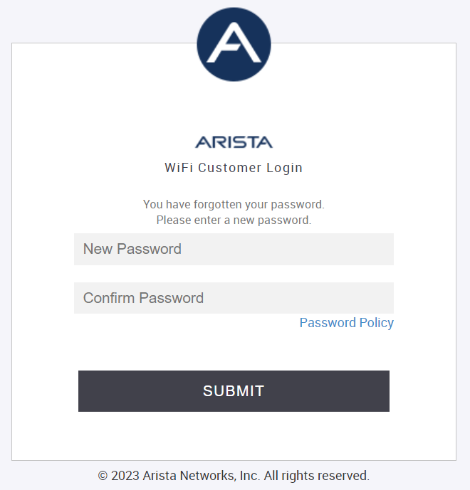
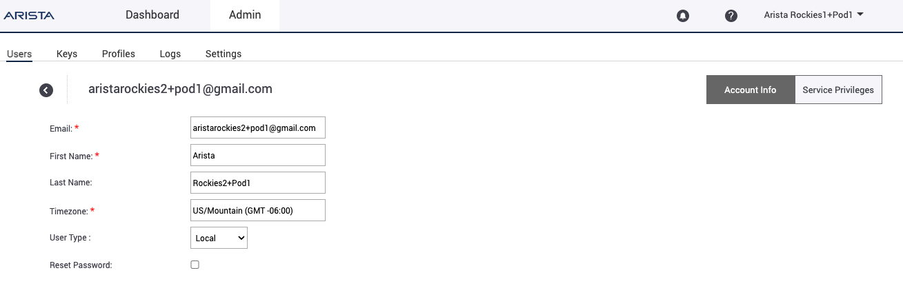
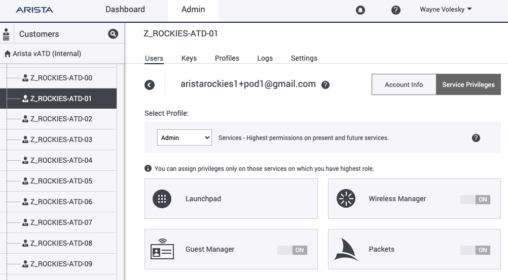

# Launchpad/CV-CUE Setup Guide

## Summary
Each CV-CUE tenant has a C260 attached to it and an admin API key to link to CVaaS and AGNI.  

Here is the master view which only a few of us will have access to.

## Login

Email accounts are all linked to ATDs, all emails should be setup with the aliases that include `pod[1-20]` as shown below.

Arista GUI: [https://launchpad.wifi.arista.com/](https://launchpad.wifi.arista.com/)

!!! example "Example: Login Credentials"

    **User Login:** aristatolas**1+pod1**@gmail.com

    **User Passwords:** `Training2024!`

Login, click `Submit` and then click `Accept & Continue`

{ width="400" }

{ width="400" }

You will see the 4 emails and the aliases associated with this "pod", in this case `pod1`

Click on `Service Privileges` and select `Admin`

{ width="400" }

{ width="400" }

