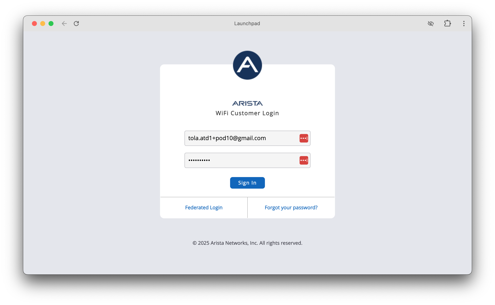

## CloudVision Login

If you're not already logged into CloudVision, navigate to the [Arista CloudVision as a Service (CVaaS) instance](https://www.cv-staging.corp.arista.io/) for your lab to access: [https://www.cv-staging.corp.arista.io/](https://www.cv-staging.corp.arista.io/)

[:cloudvision: Open CVaaS](https://www.cv-staging.corp.arista.io/){ .md-button .md-button--primary target=_blank}

=== "Login Step 1"

    In the `Organization` box enter the Organization name `tola-atd-##`  where `##` is a 2 digit character between 01-12 that was assigned to your lab/pod, then click “Enter”.

    

=== "Login Step 2"
    
    Click the `Log in with Launchpad` button and provide your assigned lab/pod email address and password:

    