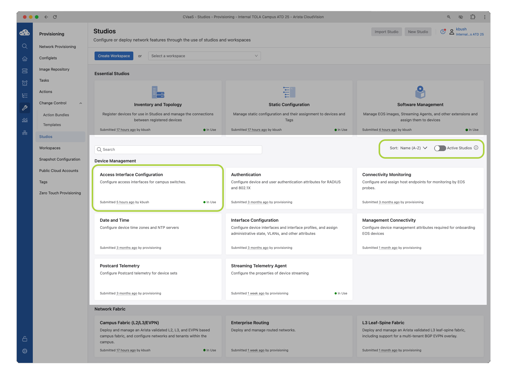
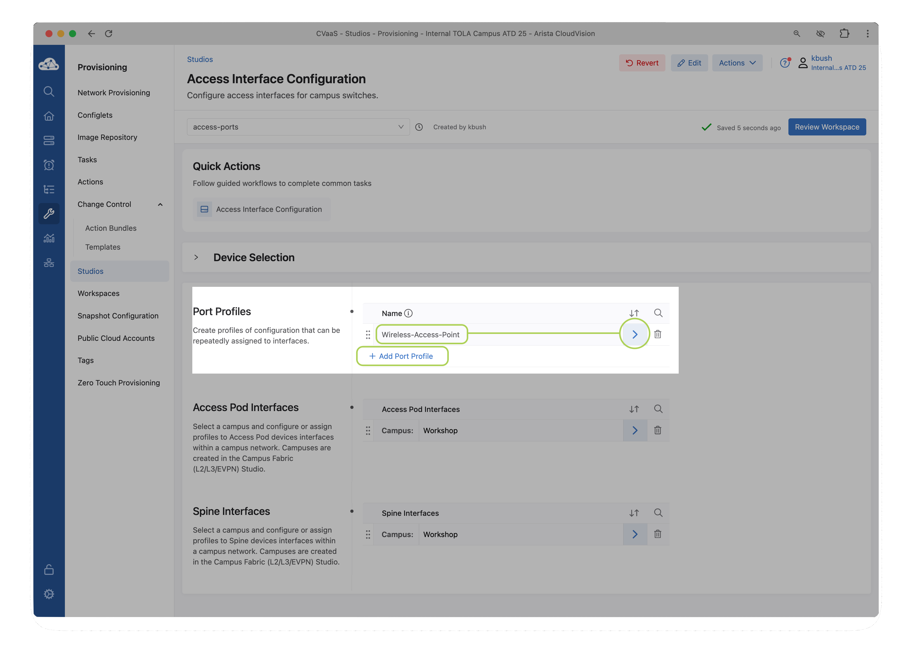
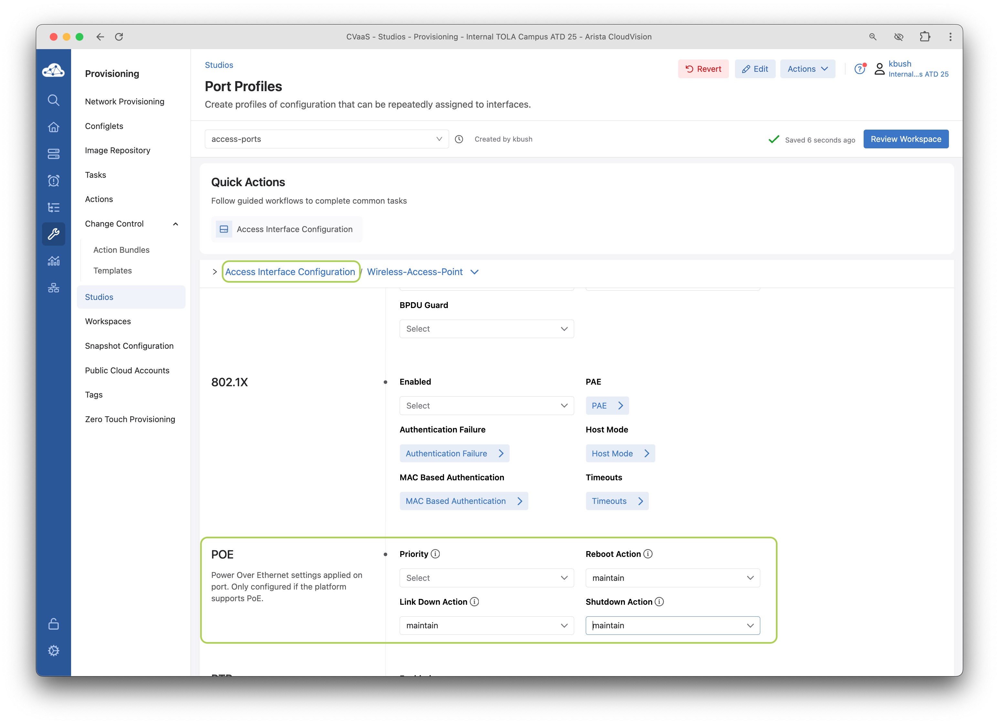
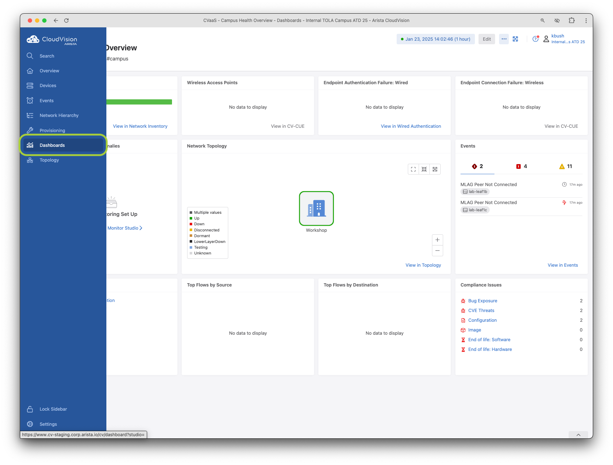
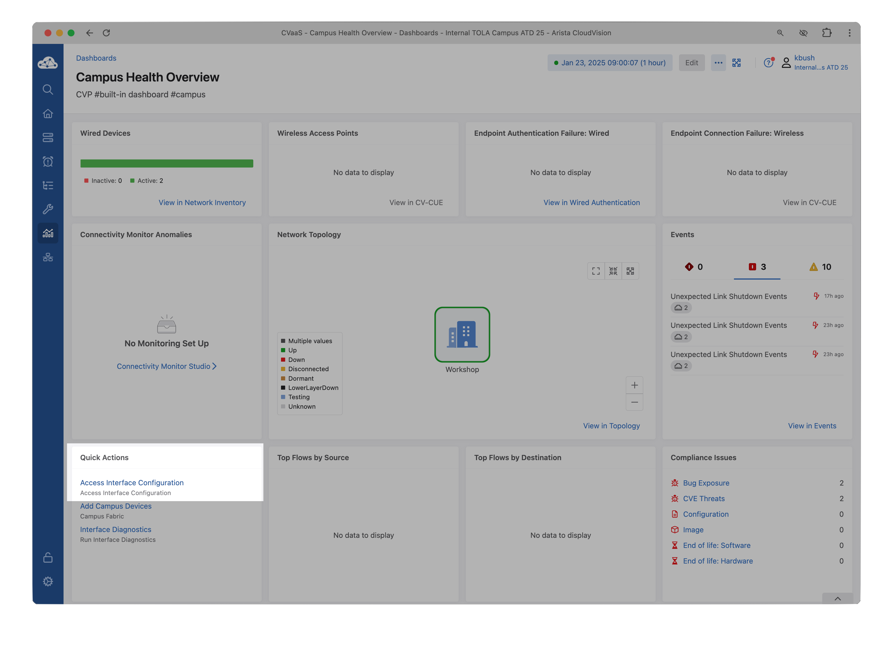
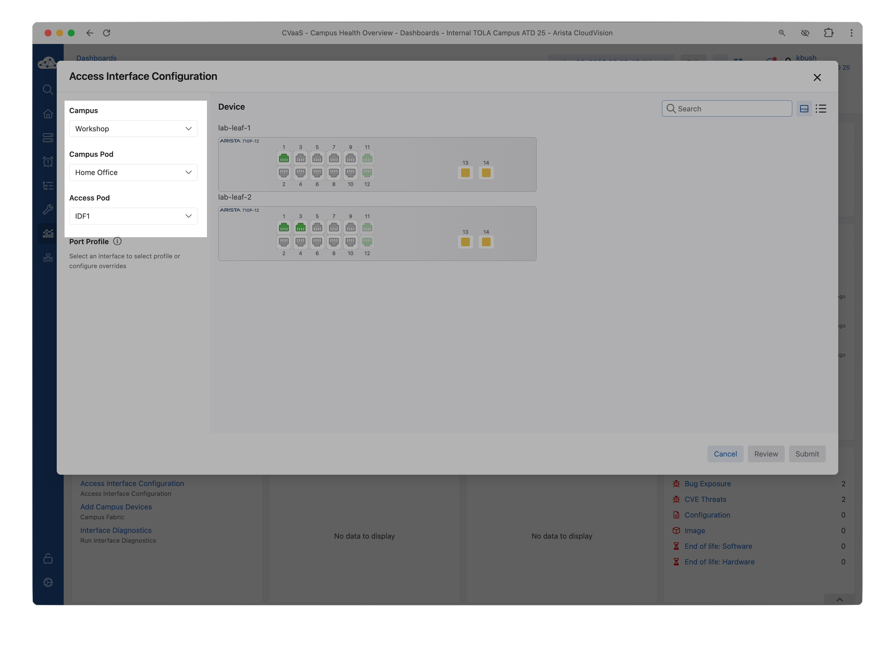
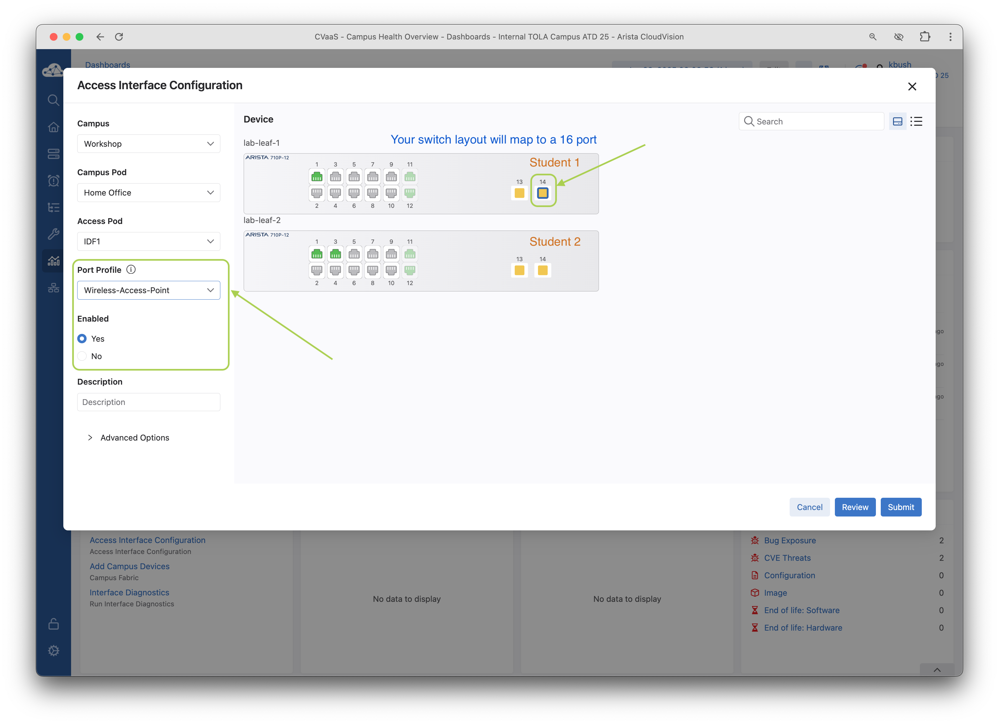
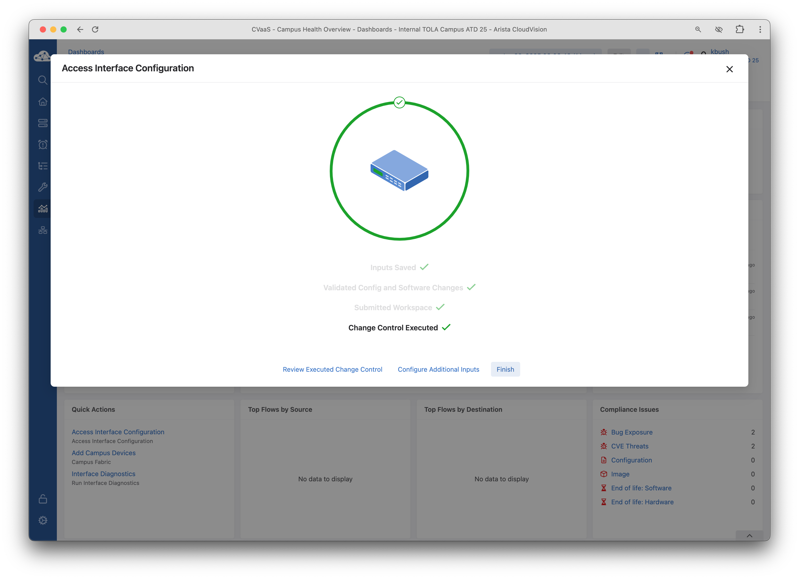
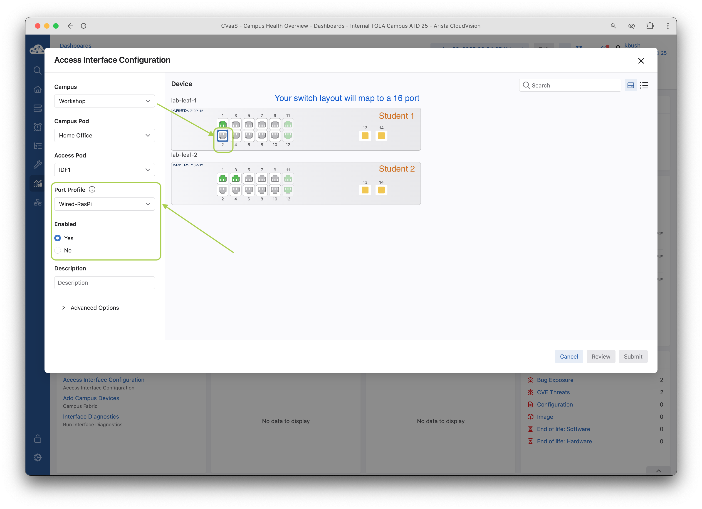
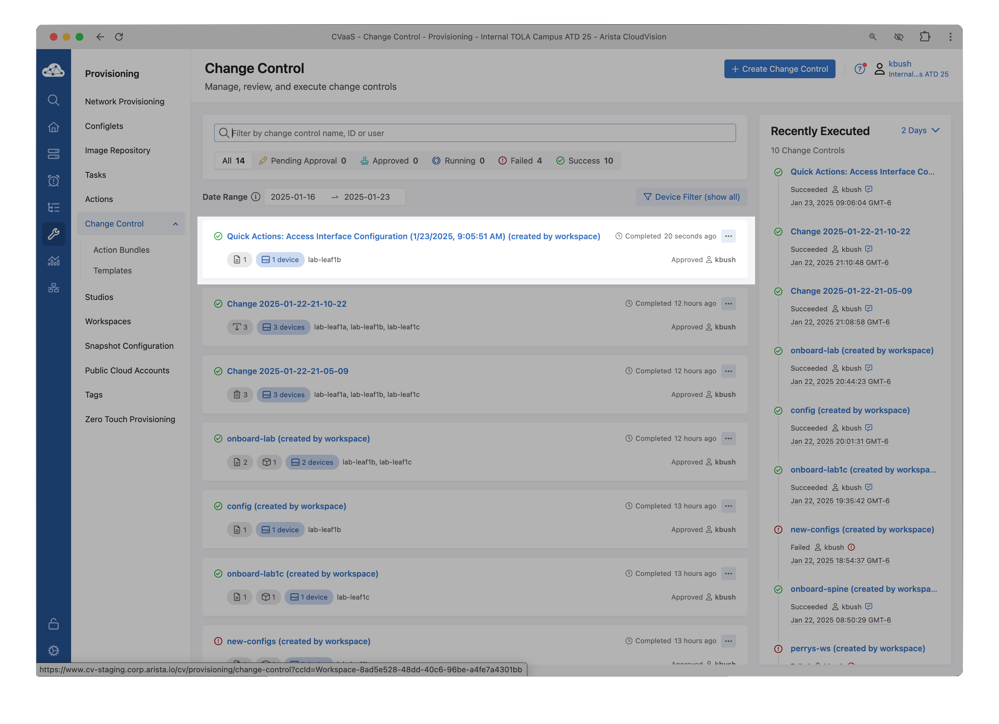

# A-02 | Access Interface Configuration

## Overview

This lab will guide you through creating port profiles and applying them to interfaces in your network.

--8<--
docs/snippets/topology.md
docs/snippets/login_cv.md
docs/snippets/workspace.md
--8<--

## 01 | Creating Port Profiles

1. From the `Studios` home page, disable the `Active Studios` toggle to display all available CloudVision Studios (which when enabled will only show used/active Studios).

    !!! note "The toggle may already be in the disabled position"

      

2. Let's create two port profiles using the `Access Interface Configuration` studio that will be used to provision connected hosts.

      1. Launch the `Access Interface Configuration`
      2. Click Add Port Profile, name it `Wireless-Access-Point`, and click the arrow on the right
      3. Enter the following values on this configuration page

    === "Create Profile"

        

    === "Configure Settings"

        

    ???+ example "Wireless-Access-Point"

        | Key                  | Value                                     |
        | -------------------- | ----------------------------------------- |
        | Description          | `Wireless-Access-Point`                   |
        | Enable               | Yes                                       |
        | Mode                 | Access                                    |
        | VLANS                | `1##` where `##` is a 2 digit pod number* |
        | POE Reboot Action    | Maintain                                  |
        | POE Link Down Action | Maintain                                  |
        | POE Shutdown Action  | Maintain                                  |

        **VLAN pod numbers between 01-12 that was assigned to your lab/Pod. Example: `Pod01` is `VLAN101`, `Pod13` is `VLAN113`*

      4. Navigate back to `Access interface Configuration` by clicking on the top
      5. Click `Add Port Profile`, name it `Wired-RasPi`, and click the arrow on the right
      6. Enter the following values on this configuration page

    ???+ example "Wired-RasPi"

        | Key                      | Value                                     |
        | ------------------------ | ----------------------------------------- |
        | Description              | `Wired-RasPi`                             |
        | Enable                   | Yes                                       |
        | Mode                     | Access                                    |
        | VLANS                    | `1##` where `##` is a 2 digit pod number* |
        | 802.1X                   | Enabled                                   |
        | MAC Based Authentication | Yes                                       |
        | POE Reboot Action        | Maintain                                  |
        | POE Link Down Action     | Maintain                                  |
        | POE Shutdown Action      | Maintain                                  |

        **VLAN pod numbers between 01-12 that was assigned to your lab/Pod. Example: `Pod01` is `VLAN101`, `Pod13` is `VLAN113`*

      7. Navigate back to the previous page

3. Review and `Submit the Workspace`

    !!! warning "Note that device configuration has NOT changed after submitting this workspace. If you see something different, create a new workspace and try again or reach out to the event staff."

      1. Click `Review Workspace`
      2. Click Submit Workspace
      3. Click Close

## 02 | Assigning Port Profiles

1. Assign the configured port profiles to the switches access ports

2. Click `Dashboard` option on the navigation bar

    

3. Locate the `Quick Actions` panel on the lower left of the screen and Click `Access Interface Configuration`

    

4. Select the following:

    !!! note "There should only be one option for each drop-down"

    

      1. Campus: `Workshop`
      2. Campus Pod: `Home Office`
      3. Access Pod: `IDF1`

5. Select to highlight port `Ethernet14` on your assigned switch: `pod<##>-leaf1(a|b)`

    !!! note "You will see a slightly different front panel layout, this is the difference between the 710P-12P and the 710P-16P you have in front of you."

    

      1. Choose the `Port Profile` of `Wireless-Access-Point`
      2. Click `Yes` radio button under `Enabled`

6. Click `Submit`

7.  Once the `Change Control` has been executed, click `Configure Additional Inputs` to configure another access port

    

8.  Again, select the following
      1. Campus: `Workshop`
      2.  Campus Pod: `Home Office`
      3.  Access Pod: `IDF1`

9.  Select to highlight port `Ethernet2` on your assigned switch `pod<##>-leaf1(a|b)`

    

      1. Choose the `Port Profile` of `Wired-RasPI`
      2. Click `Yes` radio button under `Enabled`

10. Click `Submit`

11. Once the `Change Control` has been executed, click `Finish`

    

21. Quick actions is using the same CloudVision Change Control workflow, the exception here is it's auto approved to allow low risk/impact changes easier. You can view this change control in the `Change Control` tab and see the generated task.

    

--8<-- "includes/abbreviations.md"
