# B-01 | Arista Wireless Setup

## Overview

In this lab we are going to explore the Arista Launchpad in more depth, explain how Access Points are onboarded, configured, and troubleshot in a live environment.

--8<--
docs/snippets/topology.md
docs/snippets/login_cvcue.md
--8<--

## Arista Launchpad

Launchpad is the portal to access your Arista cloud services including **WiFi Management (CV-CUE)** and **AGNI (Network Access Control)**. When you open the launcher, you are presented with management applications on the`Dashboard` menu and access controls with the`Admin` menu.

When you open the launcher, you are presented with multiple applications. Each is included with the subscription (as is support).

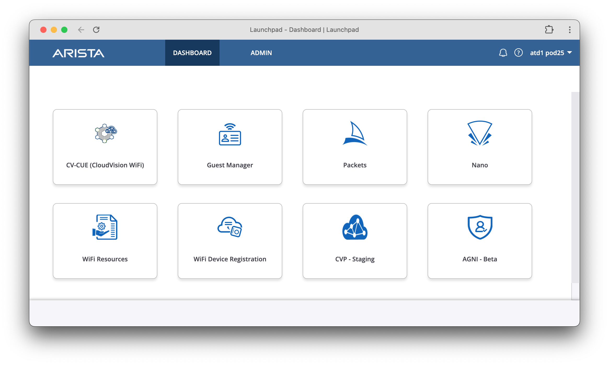

- :cloudvision: **CV-CUE CloudVision-WiFi**: Wireless Manager.
- :fontawesome-solid-user-gear: **Guest Manager**: looks at the users and how they are interacting with your environment.
- :material-cellphone-cog: **Nano**: manage your environment from your smartphone
- :material-shark-fin: **Packets**: an online .pcap debug allowing you to examine the packet information.
- :simple-googledocs: **WiFi Resources**" includes documentation and over 6 ½ hours of online training, also included.
- :material-access-point-plus: **WiFi Device Registration:** application for importing APs into your account
- :agni: **AGNI**: network access control
- :cvp: **CVP Staging (CloudVision Portal)**: switch Management and staging Environment

### Add a User and Assign Privileges

1. First, use the Admin menu to add a user.
2. Click on the Admin Tab at the top of the Launchpad window:

    

3. Overview of Launchpad Admin menu:
      1. **Users** - Assign Access to users with different access levels as well as to specific folders
      2. **Keys** - Used with API integrations
      3. **Profiles** - Defines Access levels to CV-CUE, LaunchPad, and Guest Manager
      4. **Logs** - Download User Action Logs
      5. **Settings** - Lockout Policy, Password Policy, and 2-Factor settings
4. Account Settings - Change your Timezone and Change your password.

!!! tip "Authentication"

    CloudVision CUE authenticates users via SAML directory integration or via the Launchpad identity providers. These can be customized with local users in Launchpad or directory single-sign-on users.
    More information on Arista Communities, [Integrating Third-Party SAML Authentication Providers](https://arista.my.site.com/AristaCommunity/s/article/Integrating-Third-Party-SAML-Solution-Providers-with-Arista-CV-CUE)

### AP Registration

!!! danger "Reference Information"

    For this lab, these steps have already been done for you by event staff.

    Arista AP serial numbers are automatically assigned to the user’s CV-CUE staging area when purchased. In addition, specific devices can be registered for management using the `WiFi Device Registration` function, accessible from `Launchpad Dashboard`.

1. Let’s click on the `Dashboard` menu option on the left hand side of the screen. This opens the `Dashboard Overview` screen which provides us with numerous metrics for our wireless environment.

    

2. Within the `Import` function you can provide individual AP serials and keys or upload a CSV.

    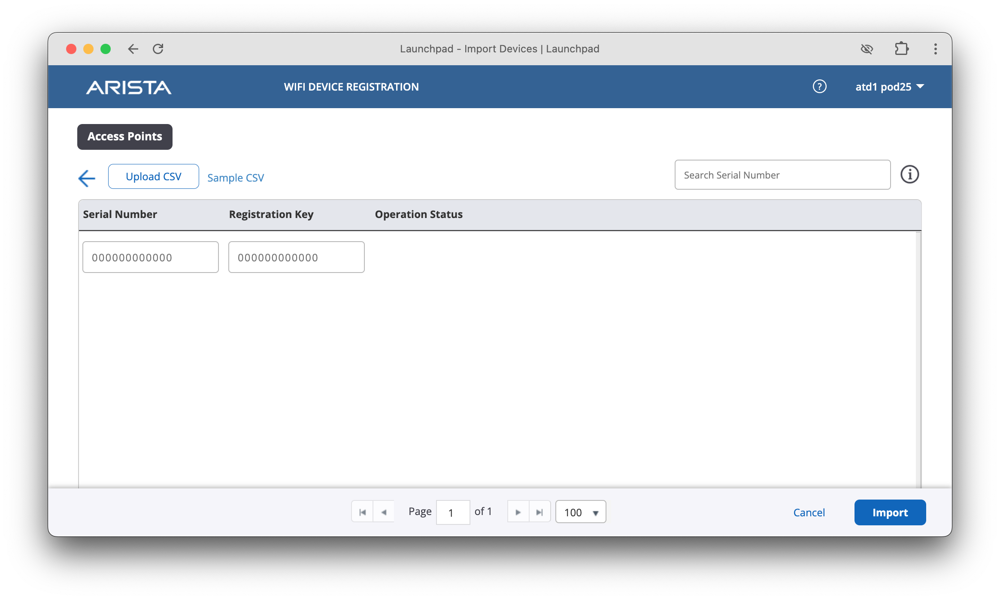

3. Assign Access points to Wireless Manager Service

    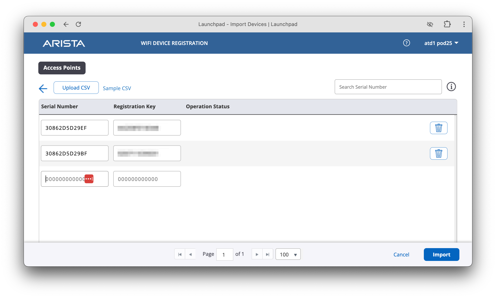

## CV-CUE CloudVision Wifi Access

CloudVision CUE - Cognitive Unified Edge, provides the management plane and monitoring functions for the Arista WiFi solution.

1. Click on the `CV-CUE (CloudVision WiFi)` Tile in the LaunchPad from the Dashboard menu.

    

2. When the CV-CUE interface launches, you are presented with an initial dashboard to monitor your wireless environment at a glance, we will revisit these metrics later in the lab. Since this is a new setup the initial dashboard screen will be mostly empty.

    

3. Use the left menu bar to select monitoring and configuration functions.

    

4. The primary menu navigation functions are the following:

      1. **Dashboard** - Alerts, Client Access, Infrastructure health, Application Experience, and WIPS
      2. **Monitor** - Monitor and explore Clients, APs, Radios, SSIDs, Application traffic, Tunnels
      3. **Configure** - WiFi SSIDs, APs and Radios, Tunnels, RADIUS, and WIPS settings
      4. **Troubleshoot** - Client connection test, packet trace, live debug logs, historic logging
      5. **Engage** - User insights, Presence, Usage, 3rd party integrations
      6. **Floor Plans** - Floor layouts and AP location map view
      7. **Reports** - Detailed information for Infrastructure APs/Radios, Client Connectivity and Experience, WIPS detections
      8. **System** - Locations Hierarchy, AP Groups, 3rd party server settings, keys and certificates

5. In addition to the menu bar navigation and Locations Hierarchy, the UI provides a common Search bar, Metric summary, and Help button throughout workflows.

    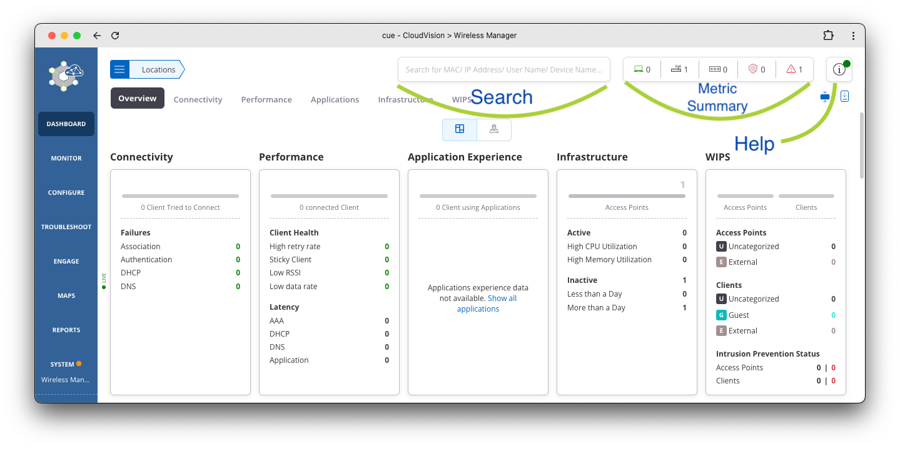

## Assign AP Name

Access points that successfully receive an IP address, DNS, and default gateway via DHCP, and have connectivity over HTTPS/TCP/443 to CV-CUE.

1. Using the left navigation bar in CV-CUE, navigate to `Monitor > WiFi`.

    { width=600" }

2. Select the Access Points section and observe the discovered AP and default name `Arista_` and the last 3 bytes of the MAC address.

3. Customize the AP’s name by clicking the 3-dots menu and Rename

    { width=600" }

4. Give the AP a name such as: `POD-##-AP1` or `POD-##-AP2` where ## is a 2 digit character between 01-12 that was assigned to your lab/Pod.

    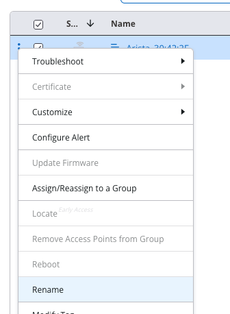

    

## Managing the Configuration Hierarchy

Within CV-CUE, much of the configuration is hierarchical, so everything you configure will be inherited from that level and it's children. Expand the `Locations` pane by clicking on the hamburger icon :material-menu:. Now select the three dots :material-dots-horizontal: to the left of `Locations` and click on `Manage Navigator`.

{ width=600" }

1. `Manage Navigator` is where you create Folders, Floors, and Groups.
      1. **Folders** typically represent a company, branch office name or division.
      2. **Floors** are straightforward and are where maps are placed.
      3. **Groups** are a way to make a configuration more granular. Let’s say you want a branch location to have all of the same configuration but Outdoor APs need to vary from that. You would create a group for the Outdoor APs, put the APs into that group and override the part of the configuration that is unique. Think of your company and how you would want to lay it out.
2. Add a `Folder` for your Company Name. In the `Navigator`, select the 3 dots :material-dots-horizontal: next to `Locations`. Select `Add Folder/Floor`

    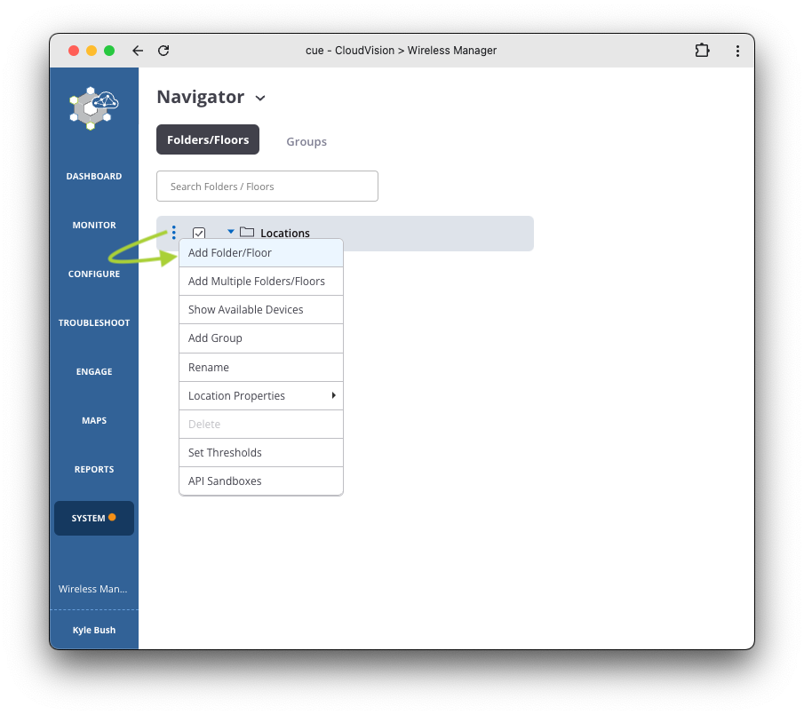{ width=600" }

3. Add a new folder using the settings below, depending on your student assignment

    ???+ example "Folder Name"

        | Student   | Folder Name |
        | --------- | :---------: |
        | Student 1 |   `ACorp`   |
        | Student 2 |   `BCorp`   |

    { width=600" }

4. Next, create 2 more folders called `1st Floor` and `2nd Floor`.  Right click on the word `Corp` to expose the menu.

    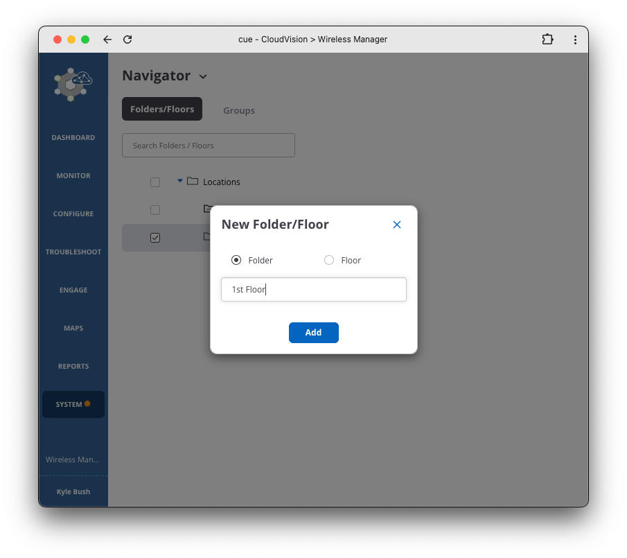{ width=600" }

    ??? tip "Add Multiple Floors"

        It’s also possible to add multiple floors at once using the `Add Multiple Folders/Floors` menu option

        
        

        *Use the `*` key to create floors instead of folders*

5. Next, move your AP into the `1st Floor` folder you created. To move your AP from the staging area, right click on the `Staging Area` folder, and select `Show Available Devices`.

    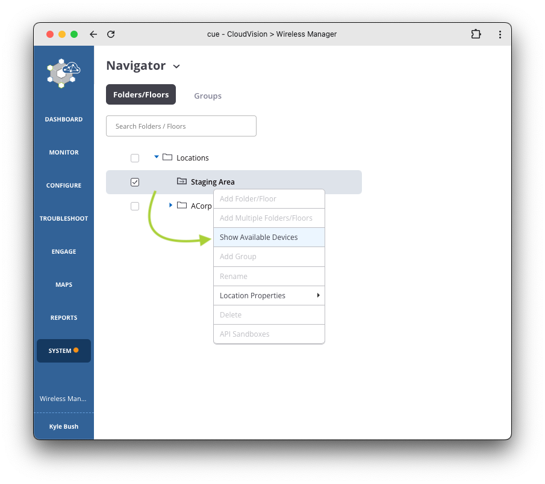

6. Next, right click on the AP name, select `Move` and then select the `1st Floor` folder you created earlier, and then click the `Move` button at the bottom of the screen.

    === "Step 1: AP Move"

        

    === "Step 2: AP Move"

        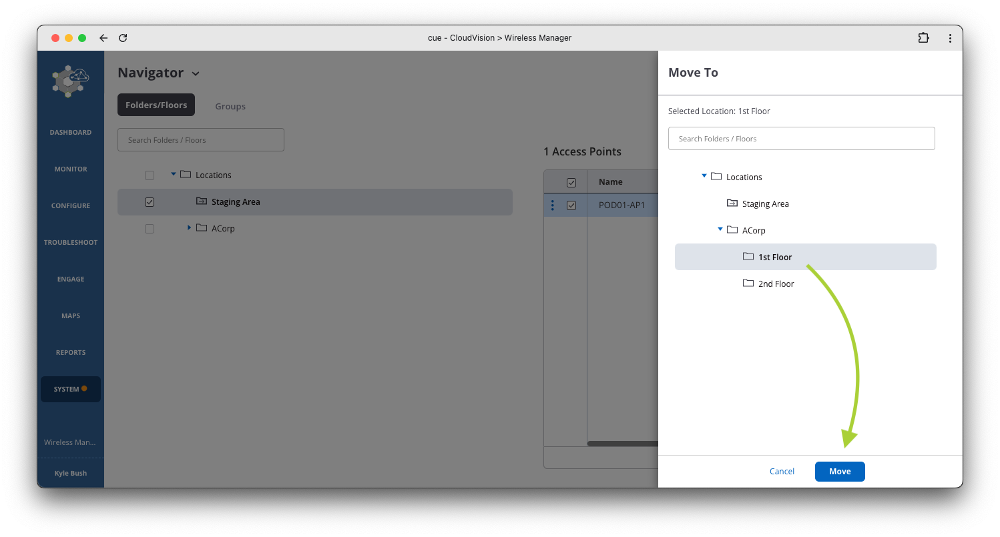

    === "Step 3: AP Move"

        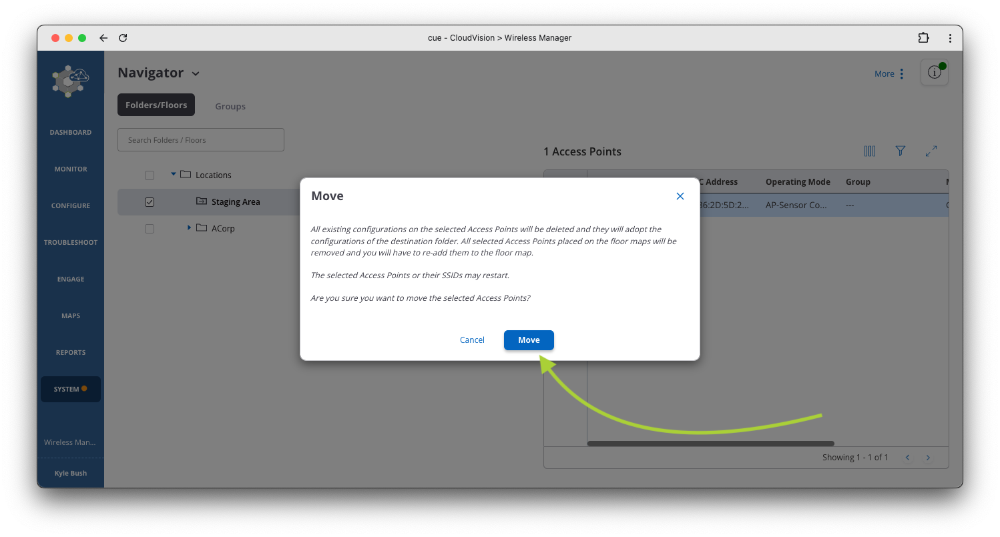

7. You’ll see a pop-up message to confirm the move. Click `Move` again to finish the process

8. You can verify the move by selecting the `1st Floor` folder and then `Show Available Devices`.

    

### Assign Floor Plan

Let's assign a floor plan to our `1st Floor` for our respective corporation. Depending on the lab guide format, you can either save the image here or download from the email. We are going to use this image and import it into CV-CUE.

!!! info ":simple-materialformkdocs: Download MkDocs Site"

    If you are viewing this guide as a MkDocs site, simply right click the image below and `Save Image As` to your Desktop.

!!! info ":fontawesome-solid-file-pdf: PDF Emailed Floor Plan"

    If you are viewing this as a PDF, check the email you received as part of this Arista Test Drive session. You will find an image attached to the email to use as a floor plan. Save that image to your computer

1. In the left hand menu, click on `Floor Plans`.  Make sure to set the location level to be `1st Floor`.  Click the `Add Floor Plan` button in the upper right corner of the screen.

    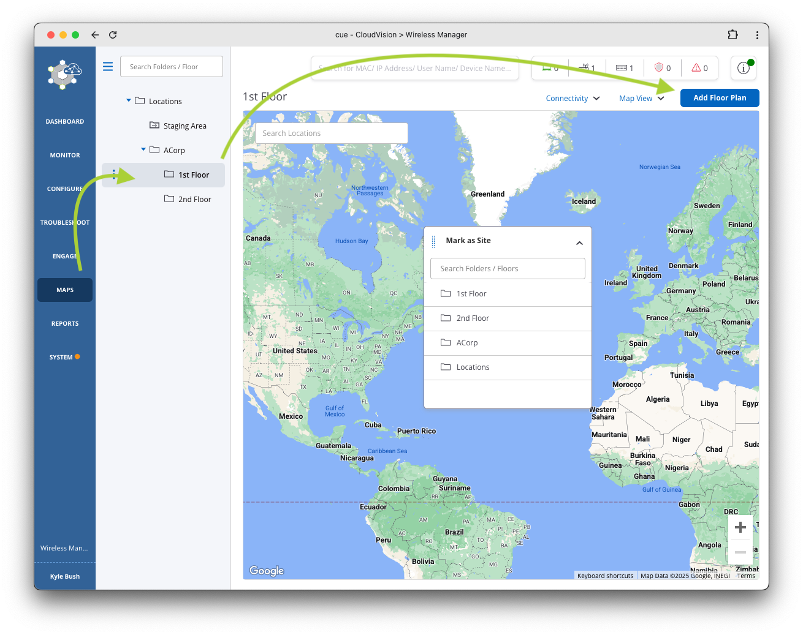

2. Enter floor name as `1st Floor`, click the `Upload Image` button to import the floor plan image, and use the following dimensions:  Floor Plan Dimensions: Unit: Feet, Length: 120, Width: 50

    ???+ example "Floor Plan Settings"

        | Key    | Value |
        | ------ | :---: |
        | Unit   | Feet  |
        | Length |  120  |
        | Width  |  50   |

    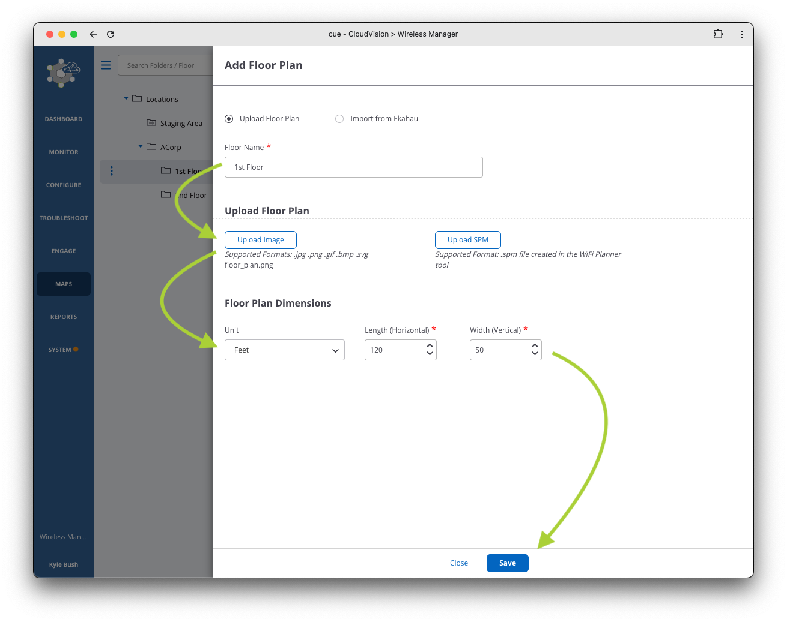

3. Click `Save` at the bottom of the screen.
4. Next, drag the AP onto the map, from the right hand side menu, to see how easy placing APs is. Choose `Place Access Points`.

    ???+ warning "I don't see my AP?"

        If you do not see an AP, it is because your AP is assigned to another location (folder) and you’ll need to move it to the `1st Floor` folder (see steps above). Or, you may have the incorrect menu selected in the upper right hand corner of the screen.

    

    

5. Hover over the AP image to get more information and then `right-click on the AP` image to see more options.

    

    - 
    - 

    

6. Next, explore the other menu options like `RF Heatmaps` (in the menu on the right hand side of the screen).

    

    

## Creating a PSK SSID

The `Configure` section of CV-CUE is broken into several parts, including `WiFi`, `Alerts`, and `WIPS`.

- `Alerts` is where syslog and other alert related settings are configured
- `WIPS` is where the policies are configured for the WIPS sensor.
- `Wifi` is what we'll be working on in this lab to create an SSID

In this section of the lab, we will be working in the `WiFi` configuration area. We will create an SSID (WPA2 PSK) with your `ATD-##-PSK` as the name and `Wireless!123` as the passkey.

1. Hover your cursor over the `Configure` menu option on the left side of the screen, then click `WiFi`.

    

2. At the top of the screen, you will see where you are in the location hierarchy. If you aren’t on `Corp`, click on the three lines :material-menu: next to `Locations` to expand the hierarchy and choose/highlight the `Corp` folder. Now click the `Add SSID` button on the right hand side of the screen.

    === "Hierarchy Collapsed"

        

    === "Hierarchy Expanded"

        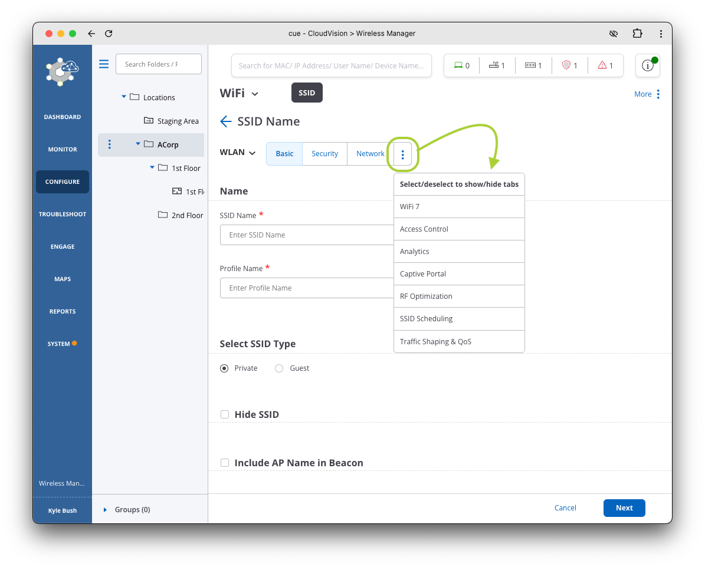

3. Once on the `SSID` page, configuration sub-category menu options will appear across the top of the page related to WiFi (the defaults are `Basic`, `Security`, and `Network`). You can click on these sub-category names to change configuration items related to that area of the configuration.

4. To make additional categories visible, click on the 3 dots :material-dots-horizontal: next to `Network` and you can see the other categories that are available to configure (`Analytics`, `Captive Portal`, etc.).

    

5. In the `Basic` sub-category option, name the SSID `ATD-##A/B-PSK` (where ## is the pod number you were assigned).  The `Profile Name` is used to describe the SSID and should have been auto-filled for you.

    ???+ example "SSID Name"

        | Student   |   SSID Name   |
        | --------- | :-----------: |
        | Student 1 | `ATD-##A-PSK` |
        | Student 2 | `ATD-##B-PSK` |

    

6. Since this is our corporate SSID, leave the `Select SSID Type` set to `Private`

    !!! tip "Guest SSID"

        Note: this is where you would change it to `Guest` if needed.

7. Select `Next` at the bottom.
8. In the `Security` sub-category, change the following settings, then select `Next` at the bottom of the screen.

    ???+ example "SSID Name"

        | Setting                       |     Value      |
        | ----------------------------- | :------------: |
        | Association Type (drop down)  |      WPA2      |
        | Authentication (radio button) |      PSK       |
        | Passphrase                    | `Wireless!123` |

    

9. In the `Network` configuration sub-category, we’ll leave the `VLAN ID` set to `0`, which means it will use the native VLAN. If the switchport the AP is attached to is trunked, you could change this setting to whichever VLAN you want the traffic dropped off on.
10. We are using `Bridged` mode in this lab. You could use the following for specific scenarios:
    1. `NAT`: often done for Guest
    2. `L2 Tunnel` / `L3 Tunnel`: as you would see for a Guest Anchor or tunneled corporate traffic

    

11. The rest of the settings can be left at the default values.
12. Click the `Save & Turn SSID On` button at the bottom of the page.
13. Only select the `5 GHz` option on the next screen (un-check the `2.4 GHz` box if it’s checked), then click “Turn SSID On”.

    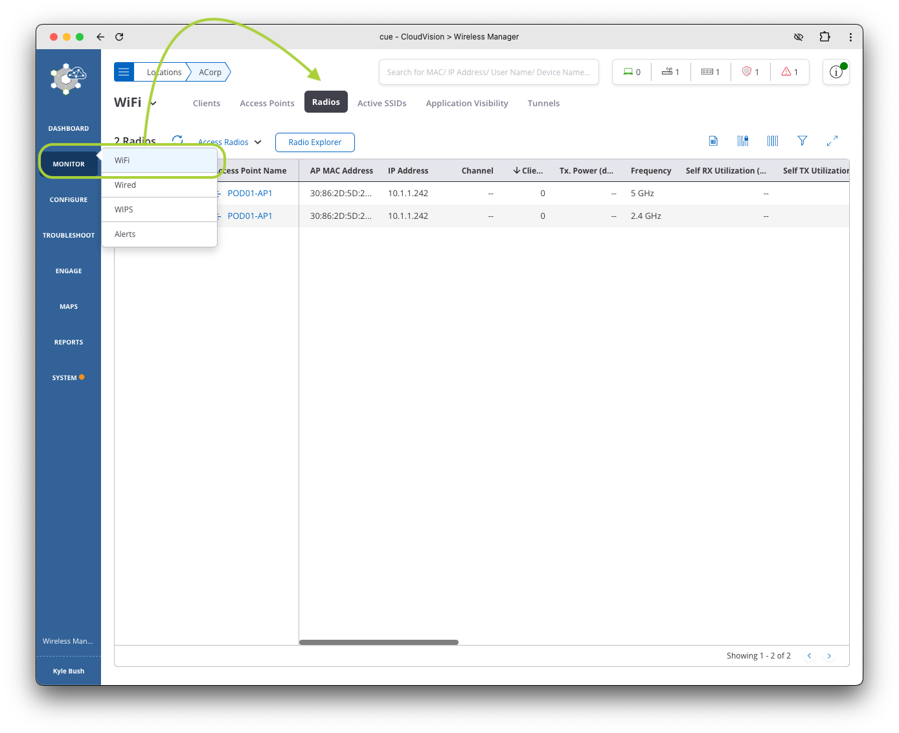

14. After you turn on the SSID, hover your cursor over `Monitor` in the left hand side menu, and then click `WiFi`.

    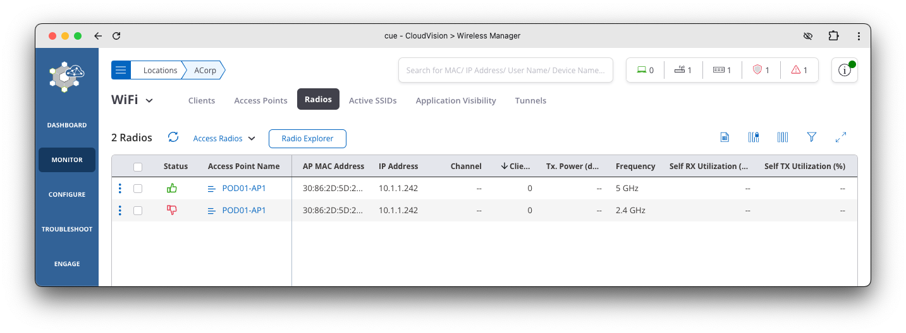

15. Now, in the menu options at the top of the page, look at the `Radios` menu option. Is the 5 GHz radio :fontawesome-regular-thumbs-up: (Up) and 2.4 GHz radio :fontawesome-regular-thumbs-down: (down)? It may take a minute or two for the radio to become active.

    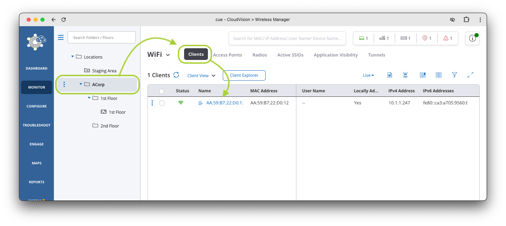

16. Check the `Active SSIDs` menu at the top of the screen. Is your SSID listed?

    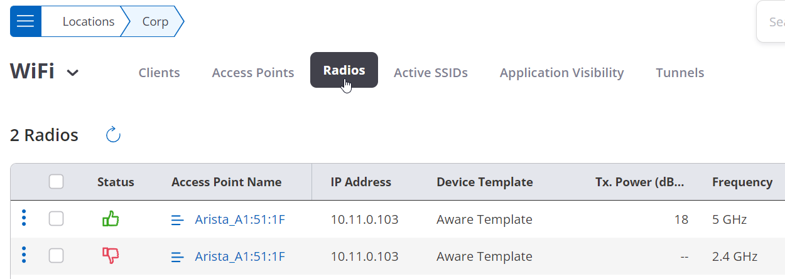

17. Next, go ahead and connect your phone to the SSID (PSK is `Wireless!123`).  Navigate to the `Clients` menu at the top of the screen and you should see your device.

    

## Troubleshooting

1. Make sure you are at your correct folder (`ACorp`  or `BCorp`) in the hierarchy
2. Hover over `Troubleshoot` in the left hand menu, then click `Packet Trace`.

    

3. On the top right hand side of the window, click `Auto Packet Trace` and select the checkbox for the SSID you created earlier (`ATD-##A-PSK`).

    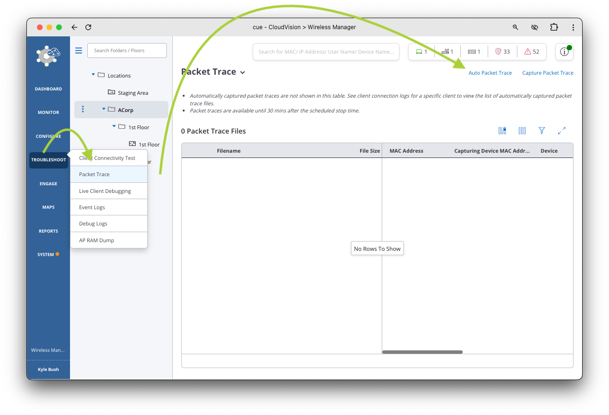

    

4. Click `Save` at the bottom of the window.

    ???+ warning "I don't see my AP?"

        If you don’t see the SSID listed, make sure you are in the correct folder in the navigation pane.

5. Next, connect your device to the AP and **type in the wrong PSK**.
6. Hover your cursor over the `Monitor` menu on the left hand side of the screen, then click `WiFi`.
7. Now click on `Clients` at the top of the page. You should see your device trying to connect.

    

8. Select on the three dots :material-dots-horizontal: next to the device name and select `Start Live Client Debugging`.

    

9. Select `30 Minutes` in the `Time Duration` drop down box, select the `Discard Logs` radio button, then click `Start`.

    

10. Next, try connecting the device again with the :octicons-x-circle-16: **Wrong PSK**. Watch and review the `Live Client Debugging` Log.

    

11. After that fails, try again with the :fontawesome-regular-circle-check: **correct PSK** (`Wireless!123`) and review the logs.
12. Once your device has successfully connected to the AP, click on the client name to learn more about the client (on the previous browser tab).

    

    - 
    - 

    

13. After you click on the client name you can gather additional information such as:
    1. Root Cause Analysis
    2. Client Events
    3. Data Rate
    4. Top Apps by Traffic
    5. Client Traffic Volume
    6. Application Experience
    7. etc.
14. Scroll down a little to the `Client Events` section select the icon to `Switch to Table View`.

    

15. Here you can see the success/failure messages, DHCP information, and other events.
16. Scroll down to the failed incorrect PSK entry and select `View Packet Trace` in the `Packet Capture` column (you may have to scroll to the right).

    

17. You should see a packet trace that you can download. Click on `View Packet Trace`.
18. Select `Open` to open the file right within CV-CUE or the Packets Application. You will be in the `Visualize` section of Packets.

    

19. You can also download the trace and view it with WireShark if you have it installed.

    

20. Click on `Time View` and `Frames` to look through the data and at the trace to see how Arista can help you troubleshoot.
21. Next, click on the back arrow icon to look at the “Analyze” feature.

    

22. Explore the `Analyze` feature by clicking on the various menu options and reviewing the data.

    

--8<-- "includes/abbreviations.md"
