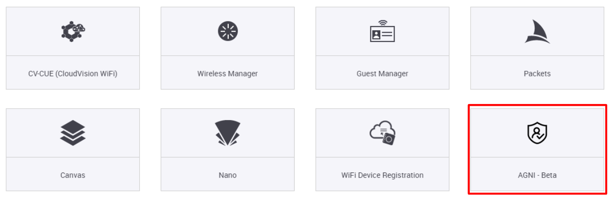
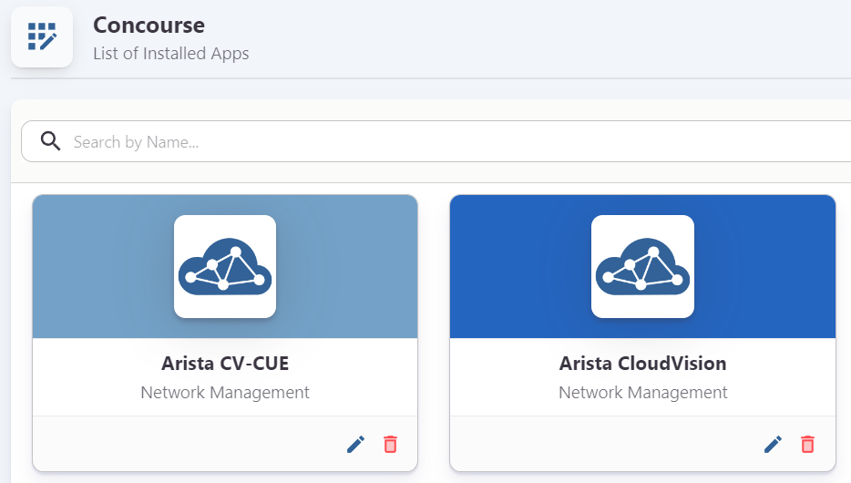
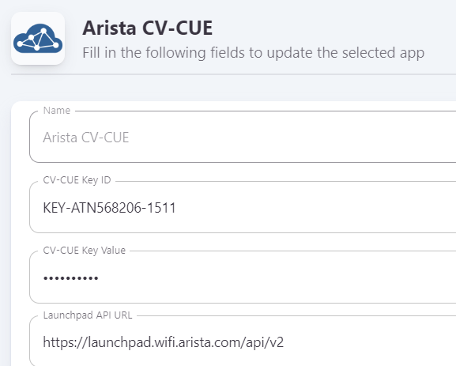

# AGNI Setup Guide

## Overview

We have been working with Anubhav Gupta and Shrirang Chikodikar for the ATD AGNI Tenants. `Z_ROCKIES-ATD-00-20` each have their own AGNI instance.  Here is the email with ATN numbers if you need to renew the trial period that Anubhav approves. Please let me know if you have any questions.

Each lab in CV-CUE will have the AGNI tile.

The AGNI instance will have the concourse Apps of CVaaS and CV-CUE preinstalled.  The RadSec connections and the 710P will also be configured.

## API Integration

Each account has a CV-CUE Key ID/Value and a CVaaS token created and located in the google drive.

- [Rockies](https://docs.google.com/spreadsheets/d/1xoTMSr9vsCBB8i9AaTevbOy06qoCXeOrXxc_xQNm6Pk/edit#gid=327826250)
- [TOLA](https://docs.google.com/spreadsheets/d/1D9KkZaMCVzOCXASzJGRFLmkdXaEjPuI-m9DE1BhnUNw/edit?usp=drive_link) 

Configure the applications using the API keys/values:

- { .lg .middle width="24"} **CV-CUE App**

    ---

    Add API Key generated from Launchpad to the Arista CV-CUE concourse application

    

    [:octicons-arrow-right-24: Generate CV-CUE API Key](./index.md#generate-launchpad-api-key){ .md-button .md-button--primary }

- :cvp:{ .lg .middle .arista } **CloudVision App**

    ---

    Add the API Key generated from CVaaS Service Account to the Arista CloudVision concourse application

    

    [:octicons-arrow-right-24: Generate CVaaS API Key](./index.md#generate-cvaas-api-key){ .md-button .md-button--primary }

## Certificate Export

Base AGNI cofiguration for RPi Certificate Export

## AP Rasec Certificate Generation/Radius Profile Creation

