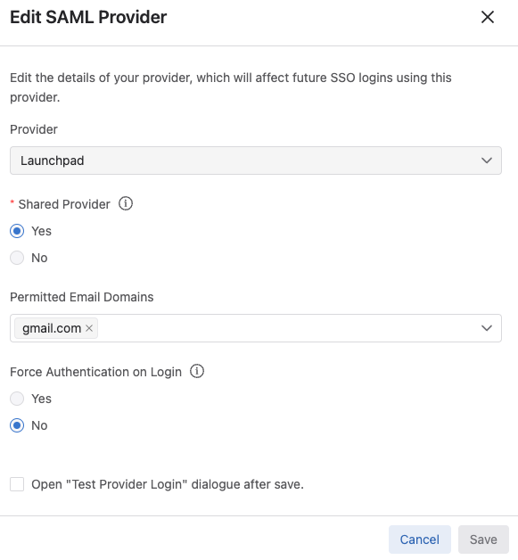
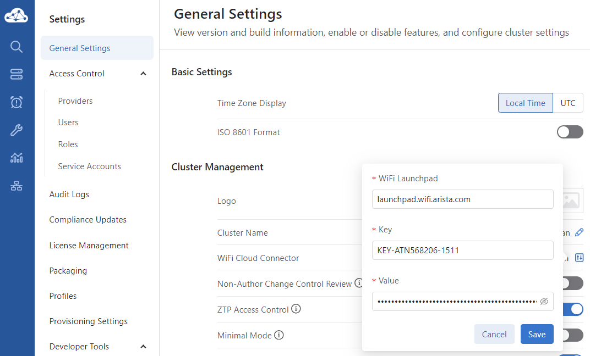
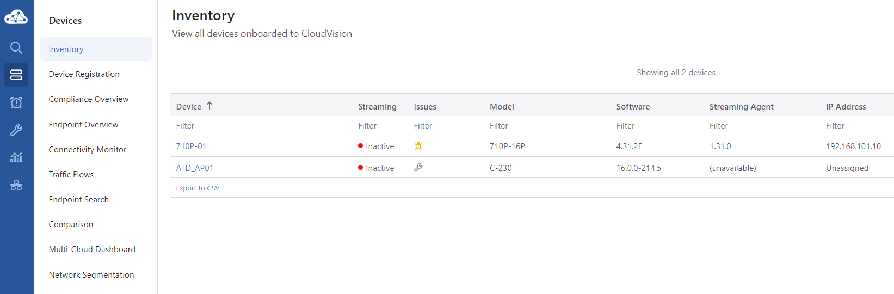
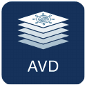

## Launchpad/CVaaS Setup

### CVaaS Accounts

Add the gmail aliases to the allowed users in the CVaaS `Settings > Users`.

Add Arista Launchpad as a new SAML provider in `Settings > Providers`, this also includes whitelisting the `gmail.com` email domain.

!!! danger "CVaaS + Launchpad Intergration"

    This will only work if you have reached out to the Wifi Ops team to have CVaaS associated with it's Launchpad instance.

### Wifi Cloud Connector

API Keys created in each CV-CUE Account and added to the corresponding CVaas Instance. Add the API key to the Cloud Connector under `Settings > General Settings`

Once connected, the CV-CUE AP’s will show up in the CVaaS Inventory.

### CVaaS Setup

There are multiple ways to setup the switch configuration, we have presented some options:

- :cvp:{ .lg .middle } **CloudVision Studios**

    ---

    Configure the lab using CloudVision Campus Studio and Change Control

    [:octicons-arrow-right-24: Studios Guide](./cvaas_studios.md){ .md-button .md-button--primary }

- { .lg .middle width="24"} **AVD CloudVision Deploy**

    ---

    Configure the lab using Arista Validated Design in combination with CloudVision Static Studios

    [:octicons-arrow-right-24: AVD Guide](./cvaas_avd.md){ .md-button .md-button--primary }

- :cvp:{ .lg .middle } **Network Provisioning**

    ---

    Configure the lab using CloudVision Network Provisioning, configlets, and change control

    [:octicons-arrow-right-24: Network Provisioning](./cvaas_configlets.md){ .md-button .md-button--primary }

