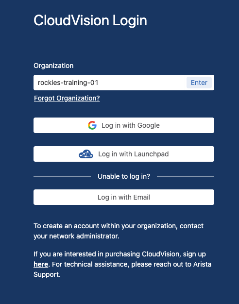
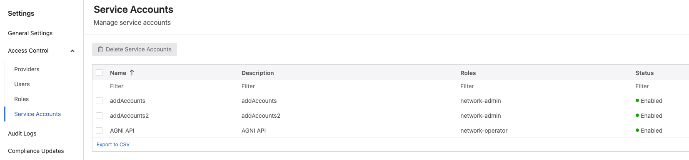

# Equipment Setup

The purpose of this document is to help guide you through setting up the initial configuration of the equipment for the event.

## Overview

The vision is to have a two day Campus event in order to teach and provide students with hands-on access to Aristas campus products. Each student will have:

- **Software**

    ---

    Each student will be provided their own instance of each of the following:

      - [x] 1 x Launchpad Access
      - [x] 1 x AGNI
      - [x] 1 x CVaaS
      - [x] 1 x CV-CUE

- **Hardware**

    ---

    Each student will be provided their own lab hardware that includes:

      - [x] 1 x C-260 
      - [x] 1 x 710P-16
      - [x] 1 x Raspberry Pi 

Each student will use their laptop to configure their devices.  Hopefully each student can bring a tablet as well to view the lab guides.  We will then utilize devices and create policies in AGNI for each student.

Having CV-CUE, CVaaS, and AGNI instances gives us the flexibility to host multiple levels of training to tailor to our attendees.  We will have the students build out Wired and Wireless segments in AGNI.  

## Workshop Size

This campus workshop is targeted to deliver this workshop to a minimum of 20 students and a maximum of 80 students. We can acomplish this using multiple accounts for instances and sharing the lab assignments.

1. **20 students** = (1 lab / 1 student email) * 20 labs
2. **40 students**= (1 lab / 2 student emails) * 20 labs
3. **60 students** = (1 lab / 3 student emails) * 20 labs
4. **80 students** = (1 lab / 4 student emails) * 20 labs

## Account Setup

At a minimum a single Gmail email should be created and aliases of this email will be used to handout to students. the single email wil be assigned all the labs via the aliases as seen in the "Campus Workshop Instances" below. If you created multipl gmail emails (4 maximum), you will assign those additional emails in the same method. This will provide multiple students access to the same lab.

!!! example "Example Format"

    **Pod 1**

      - aristatola**1**+**pod1**@gmail.com
      - aristatola**2**+**pod1**@gmail.com
      - aristatola**3**+**pod1**@gmail.com
      - aristatola**4**+**pod1**@gmail.com

    **Pod 2**

      - aristatola**1**+**pod2**@gmail.com
      - aristatola**2**+**pod2**@gmail.com
      - aristatola**3**+**pod2**@gmail.com
      - aristatola**4**+**pod2**@gmail.com

## Infrastructure Setup

The 20 CVaaS accounts are created by the CloudVision team. There are a number of steps to consider when creating this instances:

- [x] Instances must be created for
    - [x] CVaaS: instances are provisioned by the CVaaS team (reach out to ???)
    - [x] AGNI: instances are provisioned by the AGNI team (reach out to ???)
    - [x] CV-CUE: instances are provisioned by the CV-CUE team (reach out to ???)
- [x] Instance Mapping
    - [x] CV-CUE ATN numbers are mapped to each of the CVaaS tenants
    - [x] CVaaS instances must be mapped to the "Launchpad" instances created (reach out to Wifi Ops Team)
- [x] Account Setup
    - [x] Each instance should be setup with the email configured above as an alias  

There are (4) Student gmail accounts created per instance, added to LaunchPad, and mapped to the CVaaS accounts.

!!! note "Student Users"

    Student users in CVaaS are assigned the “Campus Monitoring” Profile under `Settings > Users`. 

!!! tip "Arista Instructor"

    Arista Instructors can use their email and then send the login URL to the Student's EMAIL address.

??? example "Campus Workshop Instances"

    | Pod | CV-CUE Instance | CV-CUE ATN # | CVaaS Tenant | Users                               |
    | --- | --------------- | ------------ | ------------ | ----------------------------------- |
    | 0   | Z_TOLA-ATD-00   | ATN0000002   | tola-atd-xx  | Unique accounts used for instructor |
    | 1   | Z_TOLA-ATD-01   | ATN0000003   | tola-atd-xx  | aristatola**X**+pod1@gmail.com      |
    | 2   | Z_TOLA-ATD-02   | ATN0000004   | tola-atd-xx  | aristatola**X**+pod2@gmail.com      |
    | 3   | Z_TOLA-ATD-03   | ATN0000005   | tola-atd-xx  | aristatola**X**+pod3@gmail.com      |
    | 4   | Z_TOLA-ATD-04   | ATN0000006   | tola-atd-xx  | aristatola**X**+pod4@gmail.com      |
    | 5   | Z_TOLA-ATD-05   | ATN0000007   | tola-atd-xx  | aristatola**X**+pod5@gmail.com      |
    | 6   | Z_TOLA-ATD-06   | ATN0000008   | tola-atd-xx  | aristatola**X**+pod6@gmail.com      |
    | 7   | Z_TOLA-ATD-07   | ATN0000009   | tola-atd-xx  | aristatola**X**+pod7@gmail.com      |
    | 8   | Z_TOLA-ATD-08   | ATN0000010   | tola-atd-xx  | aristatola**X**+pod8@gmail.com      |
    | 9   | Z_TOLA-ATD-09   | ATN0000011   | tola-atd-xx  | aristatola**X**+pod9@gmail.com      |
    | 10  | Z_TOLA-ATD-10   | ATN0000012   | tola-atd-xx  | aristatola**X**+pod10@gmail.com     |
    | 11  | Z_TOLA-ATD-11   | ATN0000013   | tola-atd-xx  | aristatola**X**+pod11@gmail.com     |
    | 12  | Z_TOLA-ATD-12   | ATN0000014   | tola-atd-xx  | aristatola**X**+pod12@gmail.com     |
    | 13  | Z_TOLA-ATD-13   | ATN0000015   | tola-atd-xx  | aristatola**X**+pod13@gmail.com     |
    | 14  | Z_TOLA-ATD-14   | ATN0000016   | tola-atd-xx  | aristatola**X**+pod14@gmail.com     |
    | 15  | Z_TOLA-ATD-15   | ATN0000017   | tola-atd-xx  | aristatola**X**+pod15@gmail.com     |
    | 16  | Z_TOLA-ATD-16   | ATN0000018   | tola-atd-xx  | aristatola**X**+pod16@gmail.com     |
    | 17  | Z_TOLA-ATD-17   | ATN0000019   | tola-atd-xx  | aristatola**X**+pod17@gmail.com     |
    | 18  | Z_TOLA-ATD-18   | ATN0000020   | tola-atd-xx  | aristatola**X**+pod18@gmail.com     |
    | 19  | Z_TOLA-ATD-19   | ATN0000021   | tola-atd-xx  | aristatola**X**+pod19@gmail.com     |
    | 20  | Z_TOLA-ATD-20   | ATN0000022   | tola-atd-xx  | aristatola**X**+pod20@gmail.com     |

## Generate API Keys

Before you begin, be sure to generate API keys for each student lab, for both CVaaS and CV-CUE (via Launchpad). These keys will be used throughout the intergration process.

### Generate Launchpad API Key

To generate a Launchpad API key

1. Login to Launchpad
2. Select `Admin` in the top navigation
3. Select the student tenant on the left
4. Select `Keys` in the menu above
5. Click `New Key` and give it the name `AGNI API`
6. Note the ID and Key Value, this will be supplied in AGNI and CVaaS Cloud Connector

### Generate CVaaS API Key

To generate a CVaaS API key

1. Login to CVaaS

    { width="300" }

2. Navigate to `Settings > Service Account`

    

3. Click on `New Service Account`
4. Create a new user with the below attributes for `AGNI API` and select `Create`

    

5. Generate a service account token and note it down
